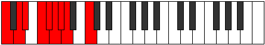

# Scale Lydyllic

## Links

- [Documentation](index.md)
- [Scales Index](Scales.md)
- [Modes Index](Modes.md)
- [Chords Index](Chords.md)

## Cardinality

8 Notes

## Perfection

- 5 Perfect Pitch
- 3 Imperfect Pitch
- [false true true false true false true true] Perfection Profile

## Modes

| Number | Mode | Notes | Illustration | Audio |
|--------|------|-------|--------------|-------|
| [1005](https://ianring.com/musictheory/scales/1005) | [Radyllic](ModeRadyllic.md) | C, D, **D#**, F, **F#**, G, G#, **A**, C |  | [midi](ModeCNaturalRadyllic.mid) [ogg](ModeCNaturalRadyllic.ogg) | 
| [1275](https://ianring.com/musictheory/scales/1275) | [Stagyllic](ModeStagyllic.md) | C, **C#**, D#, **E**, F, F#, **G**, A#, C |  | [midi](ModeCNaturalStagyllic.mid) [ogg](ModeCNaturalStagyllic.ogg) | 
| [1695](https://ianring.com/musictheory/scales/1695) | [Phrodyllic](ModePhrodyllic.md) | C, **C#**, D, D#, **E**, G, A, **A#**, C |  | [midi](ModeCNaturalPhrodyllic.mid) [ogg](ModeCNaturalPhrodyllic.ogg) | 
| [2685](https://ianring.com/musictheory/scales/2685) | [Ionoryllic](ModeIonoryllic.md) | **C**, D, **D#**, E, F, **F#**, A, B, **C** |  | [midi](ModeCNaturalIonoryllic.mid) [ogg](ModeCNaturalIonoryllic.ogg) | 
| [2895](https://ianring.com/musictheory/scales/2895) | [Aeragyllic](ModeAeragyllic.md) | **C**, C#, D, **D#**, F#, G#, **A**, B, **C** |  | [midi](ModeCNaturalAeragyllic.mid) [ogg](ModeCNaturalAeragyllic.ogg) | 
| [3495](https://ianring.com/musictheory/scales/3495) | [Banyllic](ModeBanyllic.md) | C, C#, **D**, F, G, **G#**, A#, **B**, C |  | [midi](ModeCNaturalBanyllic.mid) [ogg](ModeCNaturalBanyllic.ogg) | 
| [3795](https://ianring.com/musictheory/scales/3795) | [Epothyllic](ModeEpothyllic.md) | C, **C#**, E, F#, **G**, A, **A#**, B, C |  | [midi](ModeCNaturalEpothyllic.mid) [ogg](ModeCNaturalEpothyllic.ogg) | 
| [3945](https://ianring.com/musictheory/scales/3945) | [Lydyllic](ModeLydyllic.md) | **C**, D#, F, **F#**, G#, **A**, A#, B, **C** |  | [midi](ModeCNaturalLydyllic.mid) [ogg](ModeCNaturalLydyllic.ogg) | 
