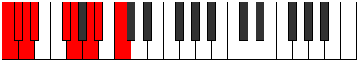

# Scale Maptyllic

## Links

- [Documentation](index.md)
- [Scales Index](Scales.md)
- [Modes Index](Modes.md)
- [Chords Index](Chords.md)

## Cardinality

8 Notes

## Perfection

- 5 Perfect Pitch
- 3 Imperfect Pitch
- [true true true false false true false true] Perfection Profile

## Modes

| Number | Mode | Notes | Illustration | Audio |
|--------|------|-------|--------------|-------|
| [987](https://ianring.com/musictheory/scales/987) | [Aeraptyllic](ModeAeraptyllic.md) | C, C#, **D#**, **E**, F#, **G**, G#, A, C |  | [midi](https://github.com/edipermadi/music/blob/main/docs/ModeCNaturalAeraptyllic.mid?raw=true) | 
| [1659](https://ianring.com/musictheory/scales/1659) | [Magyllic](ModeMagyllic.md) | **C**, **C#**, D#, **E**, F, F#, A, A#, **C** |  | [midi](https://github.com/edipermadi/music/blob/main/docs/ModeCNaturalMagyllic.mid?raw=true) | 
| [1743](https://ianring.com/musictheory/scales/1743) | [Epigyllic](ModeEpigyllic.md) | C, **C#**, D, D#, F#, G, **A**, **A#**, C |  | [midi](https://github.com/edipermadi/music/blob/main/docs/ModeCNaturalEpigyllic.mid?raw=true) | 
| [2541](https://ianring.com/musictheory/scales/2541) | [Katadyllic](ModeKatadyllic.md) | C, **D**, **D#**, F, **F#**, G, G#, B, C |  | [midi](https://github.com/edipermadi/music/blob/main/docs/ModeCNaturalKatadyllic.mid?raw=true) | 
| [2877](https://ianring.com/musictheory/scales/2877) | [Phrylyllic](ModePhrylyllic.md) | **C**, D, **D#**, E, F, G#, A, **B**, **C** |  | [midi](https://github.com/edipermadi/music/blob/main/docs/ModeCNaturalPhrylyllic.mid?raw=true) | 
| [2919](https://ianring.com/musictheory/scales/2919) | [Molyllic](ModeMolyllic.md) | **C**, C#, D, F, F#, **G#**, **A**, B, **C** |  | [midi](https://github.com/edipermadi/music/blob/main/docs/ModeCNaturalMolyllic.mid?raw=true) | 
| [3507](https://ianring.com/musictheory/scales/3507) | [Ponyllic](ModePonyllic.md) | C, C#, E, F, **G**, **G#**, A#, **B**, C |  | [midi](https://github.com/edipermadi/music/blob/main/docs/ModeCNaturalPonyllic.mid?raw=true) | 
| [3801](https://ianring.com/musictheory/scales/3801) | [Maptyllic](ModeMaptyllic.md) | C, D#, E, **F#**, **G**, A, **A#**, B, C |  | [midi](https://github.com/edipermadi/music/blob/main/docs/ModeCNaturalMaptyllic.mid?raw=true) | 
