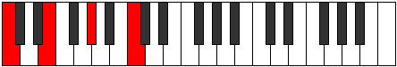

# Scale Minoric

## Links

- [Documentation](index.md)
- [Scales Index](Scales.md)
- [Modes Index](Modes.md)
- [Chords Index](Chords.md)

## Cardinality

3 Notes

## Perfection

- 0 Perfect Pitch
- 3 Imperfect Pitch
- [false false false] Perfection Profile

## Modes

| Number | Mode | Notes | Illustration | Audio |
|--------|------|-------|--------------|-------|
| [273](https://ianring.com/musictheory/scales/273) | [Minoric](ModeMinoric.md) | **C**, **E**, **G#**, **C** |  | [midi](ModeCNaturalMinoric.mid) [ogg](ModeCNaturalMinoric.ogg) | 
