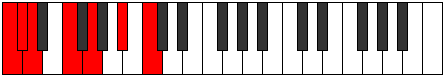

# Scale Mixolimic

## Links

- [Documentation](README.md)
- [Scales Index](Scales.md)
- [Modes Index](Modes.md)
- [Chords Index](Chords.md)

## Cardinality

6 Notes

## Perfection

- 4 Perfect Pitch
- 2 Imperfect Pitch
- [false true true true true false] Perfection Profile

## Modes

| Number | Mode | Notes | Illustration | Audio |
|--------|------|-------|--------------|-------|
| [669](https://ianring.com/musictheory/scales/669) | [Gycrimic](ModeGycrimic.md) | C, D, **Eb**, **Fb**, G, A, C |  | [midi](https://github.com/edipermadi/music/blob/main/docs/ModeCNaturalGycrimic.mid?raw=true) | 
| [933](https://ianring.com/musictheory/scales/933) | [Dadimic](ModeDadimic.md) | C, D, E#, F##, **G#**, **A**, C |  | [midi](https://github.com/edipermadi/music/blob/main/docs/ModeCNaturalDadimic.mid?raw=true) | 
| [1191](https://ianring.com/musictheory/scales/1191) | [Pyrimic](ModePyrimic.md) | C, **Db**, **Ebb**, F, G, A#, C |  | [midi](https://github.com/edipermadi/music/blob/main/docs/ModeCNaturalPyrimic.mid?raw=true) | 
| [1257](https://ianring.com/musictheory/scales/1257) | [Aeolyphimic](ModeAeolyphimic.md) | C, D#, E#, **F#**, **G**, A#, C |  | [midi](https://github.com/edipermadi/music/blob/main/docs/ModeCNaturalAeolyphimic.mid?raw=true) | 
| [2643](https://ianring.com/musictheory/scales/2643) | [Lydimic](ModeLydimic.md) | **C**, **Db**, E, F#, G##, A##, **C** |  | [midi](https://github.com/edipermadi/music/blob/main/docs/ModeCNaturalLydimic.mid?raw=true) | 
| [3369](https://ianring.com/musictheory/scales/3369) | [Mixolimic](ModeMixolimic.md) | **C**, D#, E#, F###, G###, **A##**, **C** |  | [midi](https://github.com/edipermadi/music/blob/main/docs/ModeCNaturalMixolimic.mid?raw=true) | 
