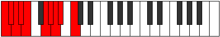

# Scale Mixolydygic

## Links

- [Documentation](README.md)
- [Scales Index](Scales.md)
- [Modes Index](Modes.md)
- [Chords Index](Chords.md)

## Cardinality

9 Notes

## Perfection

- 7 Perfect Pitch
- 2 Imperfect Pitch
Perfection Profile - false, true, true, true, false, true, true, true, true

## Modes

| Number | Mode | Luminosity | Notes | Illustration | Audio |
|--------|------|------------|-------|--------------|-------|
| [1007](https://ianring.com/musictheory/scales/1007) | [Ionycrygic](ModeIonycrygic.md) | 8 | C, C#, D, **D#**, F, F#, G, G#, **A**, C |  | [midi](https://github.com/edipermadi/music/blob/main/docs/ModeCNaturalIonycrygic.mid?raw=true) | 
| [1951](https://ianring.com/musictheory/scales/1951) | [Gonygic](ModeGonygic.md) | -1 | C, C#, D, D#, **E**, G, G#, A, **A#**, C |  | [midi](https://github.com/edipermadi/music/blob/main/docs/ModeCNaturalGonygic.mid?raw=true) | 
| [2551](https://ianring.com/musictheory/scales/2551) | [Zoptygic](ModeZoptygic.md) | -1 | C, C#, **D**, E, F, F#, G, **G#**, B, C |  | [midi](https://github.com/edipermadi/music/blob/main/docs/ModeCNaturalZoptygic.mid?raw=true) | 
| [3023](https://ianring.com/musictheory/scales/3023) | [Aeracrygic](ModeAeracrygic.md) | -1 | C, C#, D, **D#**, F#, G, G#, **A**, B, C |  | [midi](https://github.com/edipermadi/music/blob/main/docs/ModeCNaturalAeracrygic.mid?raw=true) | 
| [3323](https://ianring.com/musictheory/scales/3323) | [Phrygygic](ModePhrygygic.md) | 6 | C, **C#**, D#, E, F, F#, **G**, A#, B, C |  | [midi](https://github.com/edipermadi/music/blob/main/docs/ModeCNaturalPhrygygic.mid?raw=true) | 
| [3559](https://ianring.com/musictheory/scales/3559) | [Aerathygic](ModeAerathygic.md) | 7 | C, C#, **D**, F, F#, G, **G#**, A#, B, C |  | [midi](https://github.com/edipermadi/music/blob/main/docs/ModeCNaturalAerathygic.mid?raw=true) | 
| [3709](https://ianring.com/musictheory/scales/3709) | [Locrygic](ModeLocrygic.md) | 6 | **C**, D, D#, E, F, **F#**, A, A#, B, **C** |  | [midi](https://github.com/edipermadi/music/blob/main/docs/ModeCNaturalLocrygic.mid?raw=true) | 
| [3827](https://ianring.com/musictheory/scales/3827) | [Dorygic](ModeDorygic.md) | 7 | C, **C#**, E, F, F#, **G**, A, A#, B, C |  | [midi](https://github.com/edipermadi/music/blob/main/docs/ModeCNaturalDorygic.mid?raw=true) | 
| [3961](https://ianring.com/musictheory/scales/3961) | [Mixolydygic](ModeMixolydygic.md) | -1 | **C**, D#, E, F, **F#**, G#, A, A#, B, **C** |  | [midi](https://github.com/edipermadi/music/blob/main/docs/ModeCNaturalMixolydygic.mid?raw=true) | 
