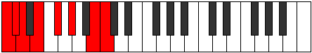

# Scale Pagian

## Links

- [Documentation](index.md)
- [Scales Index](Scales.md)
- [Modes Index](Modes.md)
- [Chords Index](Chords.md)

## Cardinality

7 Notes

## Perfection

- 4 Perfect Pitch
- 3 Imperfect Pitch
- [false true false true false true true] Perfection Profile

## Modes

| Number | Mode | Notes | Illustration | Audio |
|--------|------|-------|--------------|-------|
| [687](https://ianring.com/musictheory/scales/687) | [Aeolythian](ModeAeolythian.md) | C, **Db**, Ebb, **Fbb**, Gbb, Abb, **Bbb**, C |  | [midi](ModeCNaturalAeolythian.mid) [ogg](ModeCNaturalAeolythian.ogg) | 
| [1401](https://ianring.com/musictheory/scales/1401) | [Pagian](ModePagian.md) | **C**, D#, **E**, F, **Gb**, Ab, Bb, **C** |  | [midi](ModeCNaturalPagian.mid) [ogg](ModeCNaturalPagian.ogg) | 
| [1509](https://ianring.com/musictheory/scales/1509) | [Ragian](ModeRagian.md) | C, **D**, E#, **F#**, G, **Ab**, Bb, C |  | [midi](ModeCNaturalRagian.mid) [ogg](ModeCNaturalRagian.ogg) | 
| [1941](https://ianring.com/musictheory/scales/1941) | [Aeranian](ModeAeranian.md) | C, D, **E**, F##, **G#**, A, **Bb**, C |  | [midi](ModeCNaturalAeranian.mid) [ogg](ModeCNaturalAeranian.ogg) | 
| [2391](https://ianring.com/musictheory/scales/2391) | [Molian](ModeMolian.md) | **C**, Db, **Ebb**, Fb, Gb, **Ab**, B, **C** |  | [midi](ModeCNaturalMolian.mid) [ogg](ModeCNaturalMolian.ogg) | 
| [3243](https://ianring.com/musictheory/scales/3243) | [Staptian](ModeStaptian.md) | C, **Db**, Eb, F, **G**, A#, **B**, C |  | [midi](ModeCNaturalStaptian.mid) [ogg](ModeCNaturalStaptian.ogg) | 
| [3669](https://ianring.com/musictheory/scales/3669) | [Mothian](ModeMothian.md) | **C**, D, E, **F#**, G##, **A#**, B, **C** |  | [midi](ModeCNaturalMothian.mid) [ogg](ModeCNaturalMothian.ogg) | 
