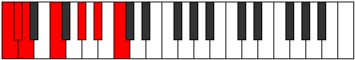

# Scale Palimic

## Links

- [Documentation](README.md)
- [Scales Index](Scales.md)
- [Modes Index](Modes.md)
- [Chords Index](Chords.md)

## Cardinality

6 Notes

## Perfection

- 3 Perfect Pitch
- 3 Imperfect Pitch
- [false true false true false true] Perfection Profile

## Modes

| Number | Mode | Notes | Illustration | Audio |
|--------|------|-------|--------------|-------|
| [629](https://ianring.com/musictheory/scales/629) | [Aeronimic](ModeAeronimic.md) | **C**, D, **E**, F, **Gb**, A, **C** |  | [midi](https://github.com/edipermadi/music/blob/main/docs/ModeCNaturalAeronimic.mid?raw=true) | 
| [937](https://ianring.com/musictheory/scales/937) | [Stothimic](ModeStothimic.md) | C, **D#**, E#, **F##**, G#, **A**, C |  | [midi](https://github.com/edipermadi/music/blob/main/docs/ModeCNaturalStothimic.mid?raw=true) | 
| [1181](https://ianring.com/musictheory/scales/1181) | [Katagimic](ModeKatagimic.md) | C, **D**, Eb, **Fb**, G, **A#**, C |  | [midi](https://github.com/edipermadi/music/blob/main/docs/ModeCNaturalKatagimic.mid?raw=true) | 
| [1319](https://ianring.com/musictheory/scales/1319) | [Phronimic](ModePhronimic.md) | **C**, Db, **Ebb**, F, **G#**, A#, **C** |  | [midi](https://github.com/edipermadi/music/blob/main/docs/ModeCNaturalPhronimic.mid?raw=true) | 
| [2707](https://ianring.com/musictheory/scales/2707) | [Banimic](ModeBanimic.md) | C, **Db**, E, **F##**, G##, **A##**, C |  | [midi](https://github.com/edipermadi/music/blob/main/docs/ModeCNaturalBanimic.mid?raw=true) | 
| [3401](https://ianring.com/musictheory/scales/3401) | [Palimic](ModePalimic.md) | **C**, D#, **E##**, F###, **G###**, A##, **C** |  | [midi](https://github.com/edipermadi/music/blob/main/docs/ModeCNaturalPalimic.mid?raw=true) | 
