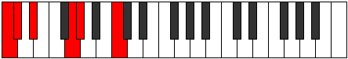

# Scale Phraditonic

## Links

- [Documentation](index.md)
- [Scales Index](Scales.md)
- [Modes Index](Modes.md)
- [Chords Index](Chords.md)

## Cardinality

5 Notes

## Perfection

- 3 Perfect Pitch
- 2 Imperfect Pitch
- [false false true true true] Perfection Profile

## Modes

| Number | Mode | Notes | Illustration | Audio |
|--------|------|-------|--------------|-------|
| [355](https://ianring.com/musictheory/scales/355) | [Aeoloritonic](ModeAeoloritonic.md) | **C**, C#, F, F#, **G#**, **C** |  | [midi](ModeCNaturalAeoloritonic.mid) [ogg](ModeCNaturalAeoloritonic.ogg) | 
| [395](https://ianring.com/musictheory/scales/395) | [Dalitonic](ModeDalitonic.md) | C, C#, **D#**, **G**, G#, C |  | [midi](ModeCNaturalDalitonic.mid) [ogg](ModeCNaturalDalitonic.ogg) | 
| [1585](https://ianring.com/musictheory/scales/1585) | [Phraditonic](ModePhraditonic.md) | **C**, **E**, F, A, A#, **C** |  | [midi](ModeCNaturalPhraditonic.mid) [ogg](ModeCNaturalPhraditonic.ogg) | 
| [2225](https://ianring.com/musictheory/scales/2225) | [Gonitonic](ModeGonitonic.md) | C, E, F, **G**, **B**, C |  | [midi](ModeCNaturalGonitonic.mid) [ogg](ModeCNaturalGonitonic.ogg) | 
| [2245](https://ianring.com/musictheory/scales/2245) | [Dygitonic](ModeDygitonic.md) | C, **D**, **F#**, G, B, C |  | [midi](ModeCNaturalDygitonic.mid) [ogg](ModeCNaturalDygitonic.ogg) | 
