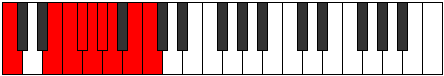

# Scale Phroryllic

## Links

- [Documentation](index.md)
- [Scales Index](Scales.md)
- [Modes Index](Modes.md)
- [Chords Index](Chords.md)

## Cardinality

8 Notes

## Perfection

- 5 Perfect Pitch
- 3 Imperfect Pitch
- [true true true false false false true true] Perfection Profile

## Modes

| Number | Mode | Notes | Illustration | Audio |
|--------|------|-------|--------------|-------|
| [447](https://ianring.com/musictheory/scales/447) | [Thyphyllic](ModeThyphyllic.md) | C, C#, **D**, **D#**, **E**, F, G, G#, C |  | [midi](ModeCNaturalThyphyllic.mid) [ogg](ModeCNaturalThyphyllic.ogg) | 
| [2019](https://ianring.com/musictheory/scales/2019) | [Palyllic](ModePalyllic.md) | C, C#, F, F#, **G**, **G#**, **A**, A#, C |  | [midi](ModeCNaturalPalyllic.mid) [ogg](ModeCNaturalPalyllic.ogg) | 
| [2271](https://ianring.com/musictheory/scales/2271) | [Poptyllic](ModePoptyllic.md) | C, **C#**, **D**, **D#**, E, F#, G, B, C |  | [midi](ModeCNaturalPoptyllic.mid) [ogg](ModeCNaturalPoptyllic.ogg) | 
| [3057](https://ianring.com/musictheory/scales/3057) | [Phroryllic](ModePhroryllic.md) | C, E, F, **F#**, **G**, **G#**, A, B, C |  | [midi](ModeCNaturalPhroryllic.mid) [ogg](ModeCNaturalPhroryllic.ogg) | 
| [3183](https://ianring.com/musictheory/scales/3183) | [Mixonyllic](ModeMixonyllic.md) | **C**, **C#**, **D**, D#, F, F#, A#, B, **C** |  | [midi](ModeCNaturalMixonyllic.mid) [ogg](ModeCNaturalMixonyllic.ogg) | 
| [3639](https://ianring.com/musictheory/scales/3639) | [Paptyllic](ModePaptyllic.md) | **C**, **C#**, D, E, F, A, A#, **B**, **C** |  | [midi](ModeCNaturalPaptyllic.mid) [ogg](ModeCNaturalPaptyllic.ogg) | 
| [3867](https://ianring.com/musictheory/scales/3867) | [Storyllic](ModeStoryllic.md) | **C**, C#, D#, E, G#, A, **A#**, **B**, **C** |  | [midi](ModeCNaturalStoryllic.mid) [ogg](ModeCNaturalStoryllic.ogg) | 
| [3981](https://ianring.com/musictheory/scales/3981) | [Phrycryllic](ModePhrycryllic.md) | C, D, D#, G, G#, **A**, **A#**, **B**, C |  | [midi](ModeCNaturalPhrycryllic.mid) [ogg](ModeCNaturalPhrycryllic.ogg) | 
