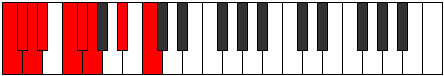
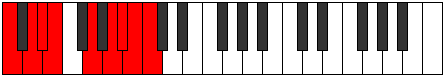

# Scale Pothyllic

## Links

- [Documentation](index.md)
- [Scales Index](Scales.md)
- [Modes Index](Modes.md)
- [Chords Index](Chords.md)

## Cardinality

8 Notes

## Perfection

- 6 Perfect Pitch
- 2 Imperfect Pitch
- [true true true false false true true true] Perfection Profile

## Modes

| Number | Mode | Notes | Illustration | Audio |
|--------|------|-------|--------------|-------|
| [957](https://ianring.com/musictheory/scales/957) | [Phronyllic](ModePhronyllic.md) | C, D, **D#**, **E**, F, G, G#, A, C |  | [midi](ModeCNaturalPhronyllic.mid) [ogg](ModeCNaturalPhronyllic.ogg) | 
| [1263](https://ianring.com/musictheory/scales/1263) | [Stynyllic](ModeStynyllic.md) | C, **C#**, **D**, D#, F, F#, G, A#, C |  | [midi](ModeCNaturalStynyllic.mid) [ogg](ModeCNaturalStynyllic.ogg) | 
| [1959](https://ianring.com/musictheory/scales/1959) | [Katolyllic](ModeKatolyllic.md) | C, C#, D, F, G, **G#**, **A**, A#, C |  | [midi](ModeCNaturalKatolyllic.mid) [ogg](ModeCNaturalKatolyllic.ogg) | 
| [2679](https://ianring.com/musictheory/scales/2679) | [Rathyllic](ModeRathyllic.md) | **C**, **C#**, D, E, F, F#, A, B, **C** |  | [midi](ModeCNaturalRathyllic.mid) [ogg](ModeCNaturalRathyllic.ogg) | 
| [3027](https://ianring.com/musictheory/scales/3027) | [Rythyllic](ModeRythyllic.md) | C, C#, E, F#, **G**, **G#**, A, B, C |  | [midi](ModeCNaturalRythyllic.mid) [ogg](ModeCNaturalRythyllic.ogg) | 
| [3387](https://ianring.com/musictheory/scales/3387) | [Aeryptyllic](ModeAeryptyllic.md) | **C**, C#, D#, E, F, G#, A#, **B**, **C** |  | [midi](ModeCNaturalAeryptyllic.mid) [ogg](ModeCNaturalAeryptyllic.ogg) | 
| [3561](https://ianring.com/musictheory/scales/3561) | [Pothyllic](ModePothyllic.md) | C, D#, F, **F#**, **G**, G#, A#, B, C |  | [midi](ModeCNaturalPothyllic.mid) [ogg](ModeCNaturalPothyllic.ogg) | 
| [3741](https://ianring.com/musictheory/scales/3741) | [Zydyllic](ModeZydyllic.md) | C, D, D#, E, G, A, **A#**, **B**, C |  | [midi](ModeCNaturalZydyllic.mid) [ogg](ModeCNaturalZydyllic.ogg) | 
