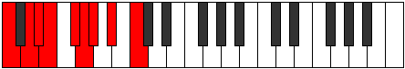

# Scale Racryllic

## Links

- [Documentation](README.md)
- [Scales Index](Scales.md)
- [Modes Index](Modes.md)
- [Chords Index](Chords.md)

## Cardinality

8 Notes

## Perfection

- 4 Perfect Pitch
- 4 Imperfect Pitch
Perfection Profile - true, false, true, false, true, false, false, true

## Modes

| Number | Mode | Luminosity | Notes | Illustration | Audio |
|--------|------|------------|-------|--------------|-------|
| [1399](https://ianring.com/musictheory/scales/1399) | [Syryllic](ModeSyryllic.md) | 6 | **C**, C#, **D**, **E**, F, F#, **G#**, A#, **C** |  | [midi](https://github.com/edipermadi/music/blob/main/docs/ModeCNaturalSyryllic.mid?raw=true) | 
| [1501](https://ianring.com/musictheory/scales/1501) | [Stygyllic](ModeStygyllic.md) | 8 | C, **D**, D#, **E**, **F#**, G, G#, **A#**, C |  | [midi](https://github.com/edipermadi/music/blob/main/docs/ModeCNaturalStygyllic.mid?raw=true) | 
| [1879](https://ianring.com/musictheory/scales/1879) | [Mixoryllic](ModeMixoryllic.md) | -1 | **C**, C#, D, **E**, F#, **G#**, A, **A#**, **C** |  | [midi](https://github.com/edipermadi/music/blob/main/docs/ModeCNaturalMixoryllic.mid?raw=true) | 
| [1909](https://ianring.com/musictheory/scales/1909) | [Epicryllic](ModeEpicryllic.md) | 6 | **C**, D, **E**, F, **F#**, **G#**, A, A#, **C** |  | [midi](https://github.com/edipermadi/music/blob/main/docs/ModeCNaturalEpicryllic.mid?raw=true) | 
| [2747](https://ianring.com/musictheory/scales/2747) | [Stythyllic](ModeStythyllic.md) | -1 | C, **C#**, **D#**, E, F, **G**, A, **B**, C |  | [midi](https://github.com/edipermadi/music/blob/main/docs/ModeCNaturalStythyllic.mid?raw=true) | 
| [2987](https://ianring.com/musictheory/scales/2987) | [Thanyllic](ModeThanyllic.md) | -1 | C, C#, **D#**, F, **G**, G#, **A**, **B**, C |  | [midi](https://github.com/edipermadi/music/blob/main/docs/ModeCNaturalThanyllic.mid?raw=true) | 
| [3421](https://ianring.com/musictheory/scales/3421) | [Aerothyllic](ModeAerothyllic.md) | -1 | **C**, **D**, D#, E, **F#**, G#, **A#**, B, **C** |  | [midi](https://github.com/edipermadi/music/blob/main/docs/ModeCNaturalAerothyllic.mid?raw=true) | 
| [3541](https://ianring.com/musictheory/scales/3541) | [Racryllic](ModeRacryllic.md) | 8 | C, **D**, E, **F#**, G, **G#**, **A#**, B, C |  | [midi](https://github.com/edipermadi/music/blob/main/docs/ModeCNaturalRacryllic.mid?raw=true) | 
