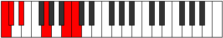

# Scale Ranitonic

## Links

- [Documentation](index.md)
- [Scales Index](Scales.md)
- [Modes Index](Modes.md)
- [Chords Index](Chords.md)

## Cardinality

5 Notes

## Perfection

- 1 Perfect Pitch
- 4 Imperfect Pitch
- [false false false true false] Perfection Profile

## Modes

| Number | Mode | Notes | Illustration | Audio |
|--------|------|-------|--------------|-------|
| [279](https://ianring.com/musictheory/scales/279) | [Poditonic](ModePoditonic.md) | **C**, C#, **D**, **E**, **G#**, **C** |  | [midi](ModeCNaturalPoditonic.mid) [ogg](ModeCNaturalPoditonic.ogg) | 
| [369](https://ianring.com/musictheory/scales/369) | [Laditonic](ModeLaditonic.md) | **C**, **E**, F, **F#**, **G#**, **C** |  | [midi](ModeCNaturalLaditonic.mid) [ogg](ModeCNaturalLaditonic.ogg) | 
| [1809](https://ianring.com/musictheory/scales/1809) | [Ranitonic](ModeRanitonic.md) | **C**, **E**, **G#**, A, **A#**, **C** |  | [midi](ModeCNaturalRanitonic.mid) [ogg](ModeCNaturalRanitonic.ogg) | 
| [2187](https://ianring.com/musictheory/scales/2187) | [Ionothitonic](ModeIonothitonic.md) | C, **C#**, **D#**, **G**, **B**, C |  | [midi](ModeCNaturalIonothitonic.mid) [ogg](ModeCNaturalIonothitonic.ogg) | 
| [3141](https://ianring.com/musictheory/scales/3141) | [Kanitonic](ModeKanitonic.md) | **C**, **D**, **F#**, **A#**, B, **C** |  | [midi](ModeCNaturalKanitonic.mid) [ogg](ModeCNaturalKanitonic.ogg) | 
