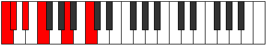
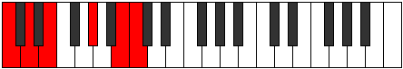

# Scale Ryphitonic

## Links

- [Documentation](index.md)
- [Scales Index](Scales.md)
- [Modes Index](Modes.md)
- [Chords Index](Chords.md)

## Cardinality

5 Notes

## Perfection

- 1 Perfect Pitch
- 4 Imperfect Pitch
- [true false false false false] Perfection Profile

## Modes

| Number | Mode | Notes | Illustration | Audio |
|--------|------|-------|--------------|-------|
| [345](https://ianring.com/musictheory/scales/345) | [Gylitonic](ModeGylitonic.md) | **C**, **D#**, **E**, **F#**, G#, **C** |  | [midi](ModeCNaturalGylitonic.mid) [ogg](ModeCNaturalGylitonic.ogg) | 
| [555](https://ianring.com/musictheory/scales/555) | [Aeolycritonic](ModeAeolycritonic.md) | **C**, **C#**, **D#**, F, **A**, **C** |  | [midi](ModeCNaturalAeolycritonic.mid) [ogg](ModeCNaturalAeolycritonic.ogg) | 
| [1425](https://ianring.com/musictheory/scales/1425) | [Ryphitonic](ModeRyphitonic.md) | C, **E**, **G**, **G#**, **A#**, C |  | [midi](ModeCNaturalRyphitonic.mid) [ogg](ModeCNaturalRyphitonic.ogg) | 
| [1605](https://ianring.com/musictheory/scales/1605) | [Zanitonic](ModeZanitonic.md) | **C**, D, **F#**, **A**, **A#**, **C** |  | [midi](ModeCNaturalZanitonic.mid) [ogg](ModeCNaturalZanitonic.ogg) | 
| [2325](https://ianring.com/musictheory/scales/2325) | [Pynitonic](ModePynitonic.md) | **C**, **D**, E, **G#**, **B**, **C** |  | [midi](ModeCNaturalPynitonic.mid) [ogg](ModeCNaturalPynitonic.ogg) | 
