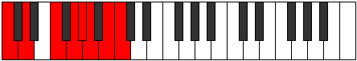

# Scale Rythian

## Links

- [Documentation](index.md)
- [Scales Index](Scales.md)
- [Modes Index](Modes.md)
- [Chords Index](Chords.md)

## Cardinality

7 Notes

## Perfection

- 4 Perfect Pitch
- 3 Imperfect Pitch
- [true true true false false false true] Perfection Profile

## Modes

| Number | Mode | Notes | Illustration | Audio |
|--------|------|-------|--------------|-------|
| [733](https://ianring.com/musictheory/scales/733) | [Donian](ModeDonian.md) | C, D, **Eb**, **Fb**, **Gb**, Abb, Bbb, C |  | [midi](ModeCNaturalDonian.mid) [ogg](ModeCNaturalDonian.ogg) | 
| [1207](https://ianring.com/musictheory/scales/1207) | [Aeoloptian](ModeAeoloptian.md) | C, **Db**, **Ebb**, **Fb**, Gbb, Abb, Bb, C |  | [midi](ModeCNaturalAeoloptian.mid) [ogg](ModeCNaturalAeoloptian.ogg) | 
| [1769](https://ianring.com/musictheory/scales/1769) | [Rythian](ModeRythian.md) | C, D#, E#, **F#**, **G**, **A**, Bb, C |  | [midi](ModeCNaturalRythian.mid) [ogg](ModeCNaturalRythian.ogg) | 
| [1867](https://ianring.com/musictheory/scales/1867) | [Solian](ModeSolian.md) | **C**, Db, Eb, F#, G#, **A**, **Bb**, **C** |  | [midi](ModeCNaturalSolian.mid) [ogg](ModeCNaturalSolian.ogg) | 
| [2651](https://ianring.com/musictheory/scales/2651) | [Panian](ModePanian.md) | **C**, **Db**, **Eb**, Fb, Gb, A, B, **C** |  | [midi](ModeCNaturalPanian.mid) [ogg](ModeCNaturalPanian.ogg) | 
| [2981](https://ianring.com/musictheory/scales/2981) | [Ionolian](ModeIonolian.md) | C, D, E#, F##, **G#**, **A**, **B**, C |  | [midi](ModeCNaturalIonolian.mid) [ogg](ModeCNaturalIonolian.ogg) | 
| [3373](https://ianring.com/musictheory/scales/3373) | [Lodian](ModeLodian.md) | **C**, **D**, Eb, F, G#, A#, **B**, **C** |  | [midi](ModeCNaturalLodian.mid) [ogg](ModeCNaturalLodian.ogg) | 
