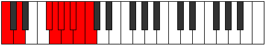

# Scale Stolyllic

## Links

- [Documentation](index.md)
- [Scales Index](Scales.md)
- [Modes Index](Modes.md)
- [Chords Index](Chords.md)

## Cardinality

8 Notes

## Perfection

- 4 Perfect Pitch
- 4 Imperfect Pitch
- [true false true false false false true true] Perfection Profile

## Modes

| Number | Mode | Notes | Illustration | Audio |
|--------|------|-------|--------------|-------|
| [383](https://ianring.com/musictheory/scales/383) | [Logyllic](ModeLogyllic.md) | **C**, C#, **D**, **D#**, **E**, F, F#, G#, **C** |  | [midi](https://github.com/edipermadi/music/blob/main/docs/ModeCNaturalLogyllic.mid?raw=true) | 
| [2033](https://ianring.com/musictheory/scales/2033) | [Stolyllic](ModeStolyllic.md) | C, **E**, F, **F#**, **G**, **G#**, A, A#, C |  | [midi](https://github.com/edipermadi/music/blob/main/docs/ModeCNaturalStolyllic.mid?raw=true) | 
| [2239](https://ianring.com/musictheory/scales/2239) | [Dacryllic](ModeDacryllic.md) | C, **C#**, **D**, **D#**, E, F, G, **B**, C |  | [midi](https://github.com/edipermadi/music/blob/main/docs/ModeCNaturalDacryllic.mid?raw=true) | 
| [3167](https://ianring.com/musictheory/scales/3167) | [Thynyllic](ModeThynyllic.md) | **C**, **C#**, **D**, D#, E, F#, **A#**, B, **C** |  | [midi](https://github.com/edipermadi/music/blob/main/docs/ModeCNaturalThynyllic.mid?raw=true) | 
| [3631](https://ianring.com/musictheory/scales/3631) | [Gydyllic](ModeGydyllic.md) | **C**, **C#**, D, D#, F, **A**, A#, **B**, **C** |  | [midi](https://github.com/edipermadi/music/blob/main/docs/ModeCNaturalGydyllic.mid?raw=true) | 
| [3863](https://ianring.com/musictheory/scales/3863) | [Eparyllic](ModeEparyllic.md) | **C**, C#, D, E, **G#**, A, **A#**, **B**, **C** |  | [midi](https://github.com/edipermadi/music/blob/main/docs/ModeCNaturalEparyllic.mid?raw=true) | 
| [3979](https://ianring.com/musictheory/scales/3979) | [Dynyllic](ModeDynyllic.md) | C, C#, D#, **G**, G#, **A**, **A#**, **B**, C |  | [midi](https://github.com/edipermadi/music/blob/main/docs/ModeCNaturalDynyllic.mid?raw=true) | 
| [4037](https://ianring.com/musictheory/scales/4037) | [Ionyllic](ModeIonyllic.md) | C, D, **F#**, G, **G#**, **A**, **A#**, B, C |  | [midi](https://github.com/edipermadi/music/blob/main/docs/ModeCNaturalIonyllic.mid?raw=true) | 
