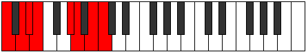

# Scale Stygian

## Links

- [Documentation](index.md)
- [Scales Index](Scales.md)
- [Modes Index](Modes.md)
- [Chords Index](Chords.md)

## Cardinality

7 Notes

## Perfection

- 4 Perfect Pitch
- 3 Imperfect Pitch
- [true true true false false true false] Perfection Profile

## Modes

| Number | Mode | Notes | Illustration | Audio |
|--------|------|-------|--------------|-------|
| [475](https://ianring.com/musictheory/scales/475) | [Aeolygian](ModeAeolygian.md) | C, Db, **Eb**, **Fb**, Gb, **Abb**, Bbbb, C |  | [midi](ModeCNaturalAeolygian.mid) [ogg](ModeCNaturalAeolygian.ogg) | 
| [1595](https://ianring.com/musictheory/scales/1595) | [Dacrian](ModeDacrian.md) | **C**, **Db**, Eb, **Fb**, Gbb, A, Bb, **C** |  | [midi](ModeCNaturalDacrian.mid) [ogg](ModeCNaturalDacrian.ogg) | 
| [1735](https://ianring.com/musictheory/scales/1735) | [Dagian](ModeDagian.md) | C, **Db**, Ebb, F#, G, **A**, **Bb**, C |  | [midi](ModeCNaturalDagian.mid) [ogg](ModeCNaturalDagian.ogg) | 
| [2285](https://ianring.com/musictheory/scales/2285) | [Aerogian](ModeAerogian.md) | C, **D**, **Eb**, F, **Gb**, Abb, B, C |  | [midi](ModeCNaturalAerogian.mid) [ogg](ModeCNaturalAerogian.ogg) | 
| [2845](https://ianring.com/musictheory/scales/2845) | [Baptian](ModeBaptian.md) | **C**, D, **Eb**, Fb, G#, A, **B**, **C** |  | [midi](ModeCNaturalBaptian.mid) [ogg](ModeCNaturalBaptian.ogg) | 
| [2915](https://ianring.com/musictheory/scales/2915) | [Aeolydian](ModeAeolydian.md) | **C**, Db, E#, F#, **G#**, **A**, B, **C** |  | [midi](ModeCNaturalAeolydian.mid) [ogg](ModeCNaturalAeolydian.ogg) | 
| [3505](https://ianring.com/musictheory/scales/3505) | [Stygian](ModeStygian.md) | C, D##, E#, **F##**, **G#**, A#, **B**, C |  | [midi](ModeCNaturalStygian.mid) [ogg](ModeCNaturalStygian.ogg) | 
