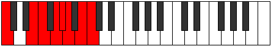

# Scale Stythian

## Links

- [Documentation](README.md)
- [Scales Index](Scales.md)
- [Modes Index](Modes.md)
- [Chords Index](Chords.md)

## Cardinality

7 Notes

## Perfection

- 4 Perfect Pitch
- 3 Imperfect Pitch
- [true true true false false true false] Perfection Profile

## Modes

| Number | Mode | Notes | Illustration | Audio |
|--------|------|-------|--------------|-------|
| [443](https://ianring.com/musictheory/scales/443) | [Kothian](ModeKothian.md) | C, Db, **Eb**, **Fb**, Gbb, **Abb**, Bbbb, C |  | [midi](https://github.com/edipermadi/music/blob/main/docs/ModeCNaturalKothian.mid?raw=true) | 
| [1591](https://ianring.com/musictheory/scales/1591) | [Rodian](ModeRodian.md) | **C**, **Db**, Ebb, **Fb**, Gbb, A, Bb, **C** |  | [midi](https://github.com/edipermadi/music/blob/main/docs/ModeCNaturalRodian.mid?raw=true) | 
| [1891](https://ianring.com/musictheory/scales/1891) | [Thalian](ModeThalian.md) | **C**, Db, E#, F#, **G#**, **A**, Bb, **C** |  | [midi](https://github.com/edipermadi/music/blob/main/docs/ModeCNaturalThalian.mid?raw=true) | 
| [2269](https://ianring.com/musictheory/scales/2269) | [Pygian](ModePygian.md) | C, **D**, **Eb**, Fb, **Gb**, Abb, B, C |  | [midi](https://github.com/edipermadi/music/blob/main/docs/ModeCNaturalPygian.mid?raw=true) | 
| [2843](https://ianring.com/musictheory/scales/2843) | [Sorian](ModeSorian.md) | **C**, Db, **Eb**, Fb, G#, A, **B**, **C** |  | [midi](https://github.com/edipermadi/music/blob/main/docs/ModeCNaturalSorian.mid?raw=true) | 
| [2993](https://ianring.com/musictheory/scales/2993) | [Stythian](ModeStythian.md) | C, D##, E#, **F##**, **G#**, A, **B**, C |  | [midi](https://github.com/edipermadi/music/blob/main/docs/ModeCNaturalStythian.mid?raw=true) | 
| [3469](https://ianring.com/musictheory/scales/3469) | [Monian](ModeMonian.md) | C, **D**, Eb, F##, G#, **A#**, **B**, C |  | [midi](https://github.com/edipermadi/music/blob/main/docs/ModeCNaturalMonian.mid?raw=true) | 
