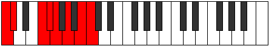

# Scale Thacrian

## Links

- [Documentation](index.md)
- [Scales Index](Scales.md)
- [Modes Index](Modes.md)
- [Chords Index](Chords.md)

## Cardinality

7 Notes

## Perfection

- 4 Perfect Pitch
- 3 Imperfect Pitch
- [false true true false false true true] Perfection Profile

## Modes

| Number | Mode | Notes | Illustration | Audio |
|--------|------|-------|--------------|-------|
| [471](https://ianring.com/musictheory/scales/471) | [Dodian](ModeDodian.md) | C, Db, **Ebb**, **Fb**, Gb, Abb, **Bbbb**, C |  | [midi](ModeCNaturalDodian.mid) [ogg](ModeCNaturalDodian.ogg) | 
| [1479](https://ianring.com/musictheory/scales/1479) | [Aeolagian](ModeAeolagian.md) | C, Db, **Ebb**, F#, G, **Ab**, **Bb**, C |  | [midi](ModeCNaturalAeolagian.mid) [ogg](ModeCNaturalAeolagian.ogg) | 
| [1821](https://ianring.com/musictheory/scales/1821) | [Aeradian](ModeAeradian.md) | **C**, D, Eb, **Fb**, G#, A, **Bb**, **C** |  | [midi](ModeCNaturalAeradian.mid) [ogg](ModeCNaturalAeradian.ogg) | 
| [2283](https://ianring.com/musictheory/scales/2283) | [Aeolyptian](ModeAeolyptian.md) | C, **Db**, **Eb**, F, Gb, **Abb**, B, C |  | [midi](ModeCNaturalAeolyptian.mid) [ogg](ModeCNaturalAeolyptian.ogg) | 
| [2787](https://ianring.com/musictheory/scales/2787) | [Zyrian](ModeZyrian.md) | C, **Db**, E#, F#, **G**, **A**, B, C |  | [midi](ModeCNaturalZyrian.mid) [ogg](ModeCNaturalZyrian.ogg) | 
| [3189](https://ianring.com/musictheory/scales/3189) | [Aeolonian](ModeAeolonian.md) | **C**, **D**, E, F, **Gb**, A#, B, **C** |  | [midi](ModeCNaturalAeolonian.mid) [ogg](ModeCNaturalAeolonian.ogg) | 
| [3441](https://ianring.com/musictheory/scales/3441) | [Thacrian](ModeThacrian.md) | **C**, D##, E#, **F#**, **G#**, A#, B, **C** |  | [midi](ModeCNaturalThacrian.mid) [ogg](ModeCNaturalThacrian.ogg) | 
