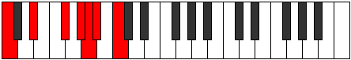

# Scale Thagimic

## Links

- [Documentation](index.md)
- [Scales Index](Scales.md)
- [Modes Index](Modes.md)
- [Chords Index](Chords.md)

## Cardinality

6 Notes

## Perfection

- 2 Perfect Pitch
- 4 Imperfect Pitch
- [false true false true false false] Perfection Profile

## Modes

| Number | Mode | Notes | Illustration | Audio |
|--------|------|-------|--------------|-------|
| [605](https://ianring.com/musictheory/scales/605) | [Dycrimic](ModeDycrimic.md) | **C**, D, **Eb**, **Fb**, **Gb**, A, **C** |  | [midi](https://github.com/edipermadi/music/blob/main/docs/ModeCNaturalDycrimic.mid?raw=true) | 
| [745](https://ianring.com/musictheory/scales/745) | [Kolimic](ModeKolimic.md) | C, **D#**, E#, **F#**, **G**, **A**, C |  | [midi](https://github.com/edipermadi/music/blob/main/docs/ModeCNaturalKolimic.mid?raw=true) | 
| [1175](https://ianring.com/musictheory/scales/1175) | [Epycrimic](ModeEpycrimic.md) | C, **Db**, **Ebb**, **Fb**, G, **A#**, C |  | [midi](https://github.com/edipermadi/music/blob/main/docs/ModeCNaturalEpycrimic.mid?raw=true) | 
| [1865](https://ianring.com/musictheory/scales/1865) | [Thagimic](ModeThagimic.md) | **C**, D#, **E##**, F###, **G##**, **A#**, **C** |  | [midi](https://github.com/edipermadi/music/blob/main/docs/ModeCNaturalThagimic.mid?raw=true) | 
| [2635](https://ianring.com/musictheory/scales/2635) | [Gocrimic](ModeGocrimic.md) | **C**, **Db**, **Eb**, F#, **G##**, A##, **C** |  | [midi](https://github.com/edipermadi/music/blob/main/docs/ModeCNaturalGocrimic.mid?raw=true) | 
| [3365](https://ianring.com/musictheory/scales/3365) | [Katolimic](ModeKatolimic.md) | **C**, **D**, E#, **F###**, G###, **A##**, **C** |  | [midi](https://github.com/edipermadi/music/blob/main/docs/ModeCNaturalKatolimic.mid?raw=true) | 
