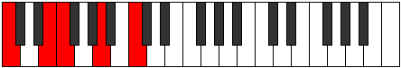

# Scale Thaptic

## Links

- [Documentation](index.md)
- [Scales Index](Scales.md)
- [Modes Index](Modes.md)
- [Chords Index](Chords.md)

## Cardinality

4 Notes

## Perfection

- 2 Perfect Pitch
- 2 Imperfect Pitch
- [true true false false] Perfection Profile

## Modes

| Number | Mode | Notes | Illustration | Audio |
|--------|------|-------|--------------|-------|
| [291](https://ianring.com/musictheory/scales/291) | [Aerathic](ModeAerathic.md) | **C**, C#, F, **G#**, **C** |  | [midi](ModeCNaturalAerathic.mid) [ogg](ModeCNaturalAerathic.ogg) | 
| [393](https://ianring.com/musictheory/scales/393) | [Lothic](ModeLothic.md) | C, **D#**, **G**, G#, C |  | [midi](ModeCNaturalLothic.mid) [ogg](ModeCNaturalLothic.ogg) | 
| [561](https://ianring.com/musictheory/scales/561) | [Phratic](ModePhratic.md) | **C**, **E**, F, A, **C** |  | [midi](ModeCNaturalPhratic.mid) [ogg](ModeCNaturalPhratic.ogg) | 
| [2193](https://ianring.com/musictheory/scales/2193) | [Thaptic](ModeThaptic.md) | C, E, **G**, **B**, C |  | [midi](ModeCNaturalThaptic.mid) [ogg](ModeCNaturalThaptic.ogg) | 
