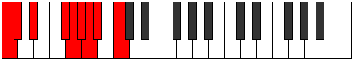

# Scale Tharyllic

## Links

- [Documentation](README.md)
- [Scales Index](Scales.md)
- [Modes Index](Modes.md)
- [Chords Index](Chords.md)

## Cardinality

8 Notes

## Perfection

- 5 Perfect Pitch
- 3 Imperfect Pitch
Perfection Profile - true, true, false, true, false, false, true, true

## Modes

| Number | Mode | Luminosity | Notes | Illustration | Audio |
|--------|------|------------|-------|--------------|-------|
| [735](https://ianring.com/musictheory/scales/735) | [Sylyllic](ModeSylyllic.md) | -1 | C, **C#**, D, **D#**, **E**, F#, G, A, C |  | [midi](https://github.com/edipermadi/music/blob/main/docs/ModeCNaturalSylyllic.mid?raw=true) | 
| [1785](https://ianring.com/musictheory/scales/1785) | [Tharyllic](ModeTharyllic.md) | 5 | C, D#, **E**, F, **F#**, **G**, A, A#, C |  | [midi](https://github.com/edipermadi/music/blob/main/docs/ModeCNaturalTharyllic.mid?raw=true) | 
| [1995](https://ianring.com/musictheory/scales/1995) | [Aeolacryllic](ModeAeolacryllic.md) | 8 | C, C#, D#, F#, **G**, G#, **A**, **A#**, C |  | [midi](https://github.com/edipermadi/music/blob/main/docs/ModeCNaturalAeolacryllic.mid?raw=true) | 
| [2415](https://ianring.com/musictheory/scales/2415) | [Lothyllic](ModeLothyllic.md) | -1 | **C**, C#, **D**, **D#**, F, F#, G#, B, **C** |  | [midi](https://github.com/edipermadi/music/blob/main/docs/ModeCNaturalLothyllic.mid?raw=true) | 
| [3045](https://ianring.com/musictheory/scales/3045) | [Raptyllic](ModeRaptyllic.md) | -1 | C, D, F, **F#**, G, **G#**, **A**, B, C |  | [midi](https://github.com/edipermadi/music/blob/main/docs/ModeCNaturalRaptyllic.mid?raw=true) | 
| [3255](https://ianring.com/musictheory/scales/3255) | [Daryllic](ModeDaryllic.md) | -1 | C, **C#**, **D**, E, F, G, A#, **B**, C |  | [midi](https://github.com/edipermadi/music/blob/main/docs/ModeCNaturalDaryllic.mid?raw=true) | 
| [3675](https://ianring.com/musictheory/scales/3675) | [Monyllic](ModeMonyllic.md) | -1 | **C**, **C#**, D#, E, F#, A, **A#**, B, **C** |  | [midi](https://github.com/edipermadi/music/blob/main/docs/ModeCNaturalMonyllic.mid?raw=true) | 
| [3885](https://ianring.com/musictheory/scales/3885) | [Styryllic](ModeStyryllic.md) | 4 | **C**, D, D#, F, G#, **A**, A#, **B**, **C** |  | [midi](https://github.com/edipermadi/music/blob/main/docs/ModeCNaturalStyryllic.mid?raw=true) | 
