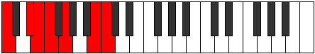

# Scale Thogimic

## Links

- [Documentation](README.md)
- [Scales Index](Scales.md)
- [Modes Index](Modes.md)
- [Chords Index](Chords.md)

## Cardinality

6 Notes

## Perfection

- 3 Perfect Pitch
- 3 Imperfect Pitch
- [false false true false true true] Perfection Profile

## Modes

| Number | Mode | Notes | Illustration | Audio |
|--------|------|-------|--------------|-------|
| [371](https://ianring.com/musictheory/scales/371) | [Rythimic](ModeRythimic.md) | **C**, Db, **E**, F, Gb, **Ab**, **C** |  | [midi](https://github.com/edipermadi/music/blob/main/docs/ModeCNaturalRythimic.mid?raw=true) | 
| [791](https://ianring.com/musictheory/scales/791) | [Aeoloptimic](ModeAeoloptimic.md) | **C**, Db, Ebb, **Fb**, **G#**, A, **C** |  | [midi](https://github.com/edipermadi/music/blob/main/docs/ModeCNaturalAeoloptimic.mid?raw=true) | 
| [1841](https://ianring.com/musictheory/scales/1841) | [Thogimic](ModeThogimic.md) | **C**, **D##**, E#, **F###**, G##, A#, **C** |  | [midi](https://github.com/edipermadi/music/blob/main/docs/ModeCNaturalThogimic.mid?raw=true) | 
| [2233](https://ianring.com/musictheory/scales/2233) | [Donimic](ModeDonimic.md) | C, **D#**, E, F, **G**, **A##**, C |  | [midi](https://github.com/edipermadi/music/blob/main/docs/ModeCNaturalDonimic.mid?raw=true) | 
| [2443](https://ianring.com/musictheory/scales/2443) | [Panimic](ModePanimic.md) | C, Db, **Eb**, **F##**, G#, **A##**, C |  | [midi](https://github.com/edipermadi/music/blob/main/docs/ModeCNaturalPanimic.mid?raw=true) | 
| [3269](https://ianring.com/musictheory/scales/3269) | [Lodimic](ModeLodimic.md) | C, **D**, **E##**, F##, **G###**, A##, C |  | [midi](https://github.com/edipermadi/music/blob/main/docs/ModeCNaturalLodimic.mid?raw=true) | 
