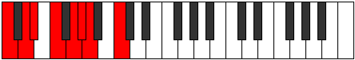
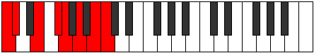

# Scale Thonian

## Links

- [Documentation](README.md)
- [Scales Index](Scales.md)
- [Modes Index](Modes.md)
- [Chords Index](Chords.md)

## Cardinality

7 Notes

## Perfection

- 5 Perfect Pitch
- 2 Imperfect Pitch
Perfection Profile - false, true, true, false, true, true, true

## Modes

| Number | Mode | Luminosity | Notes | Illustration | Audio |
|--------|------|------------|-------|--------------|-------|
| [941](https://ianring.com/musictheory/scales/941) | [Phrorian](ModePhrorian.md) | -1 | C, D, **Eb**, F, G, Ab, **Bbb**, C |  | [midi](https://github.com/edipermadi/music/blob/main/docs/ModeCNaturalPhrorian.mid?raw=true) | 
| [1259](https://ianring.com/musictheory/scales/1259) | [Stadian](ModeStadian.md) | 4 | C, **Db**, Eb, F, Gb, **Abb**, Bb, C |  | [midi](https://github.com/edipermadi/music/blob/main/docs/ModeCNaturalStadian.mid?raw=true) | 
| [1447](https://ianring.com/musictheory/scales/1447) | [Mixopyrian](ModeMixopyrian.md) | 5 | C, Db, **Ebb**, F, G, **Ab**, Bb, C |  | [midi](https://github.com/edipermadi/music/blob/main/docs/ModeCNaturalMixopyrian.mid?raw=true) | 
| [1693](https://ianring.com/musictheory/scales/1693) | [Dogian](ModeDogian.md) | 7 | C, D, Eb, **Fb**, G, A, **Bb**, C |  | [midi](https://github.com/edipermadi/music/blob/main/docs/ModeCNaturalDogian.mid?raw=true) | 
| [2677](https://ianring.com/musictheory/scales/2677) | [Thodian](ModeThodian.md) | 6 | **C**, D, E, F, **Gb**, A, B, **C** |  | [midi](https://github.com/edipermadi/music/blob/main/docs/ModeCNaturalThodian.mid?raw=true) | 
| [2771](https://ianring.com/musictheory/scales/2771) | [Garian](ModeGarian.md) | 7 | C, **Db**, E, F#, **G**, A, B, C |  | [midi](https://github.com/edipermadi/music/blob/main/docs/ModeCNaturalGarian.mid?raw=true) | 
| [3433](https://ianring.com/musictheory/scales/3433) | [Thonian](ModeThonian.md) | -1 | **C**, D#, E#, **F#**, G#, A#, B, **C** |  | [midi](https://github.com/edipermadi/music/blob/main/docs/ModeCNaturalThonian.mid?raw=true) | 
