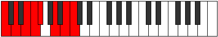

# Scale Thonian

## Links

- [Documentation](index.md)
- [Scales Index](Scales.md)
- [Modes Index](Modes.md)
- [Chords Index](Chords.md)

## Cardinality

7 Notes

## Perfection

- 5 Perfect Pitch
- 2 Imperfect Pitch
- [false true true false true true true] Perfection Profile

## Modes

| Number | Mode | Notes | Illustration | Audio |
|--------|------|-------|--------------|-------|
| [941](https://ianring.com/musictheory/scales/941) | [Phrorian](ModePhrorian.md) | C, D, **Eb**, F, G, Ab, **Bbb**, C |  | [midi](ModeCNaturalPhrorian.mid) [ogg](ModeCNaturalPhrorian.ogg) | 
| [1259](https://ianring.com/musictheory/scales/1259) | [Stadian](ModeStadian.md) | C, **Db**, Eb, F, Gb, **Abb**, Bb, C |  | [midi](ModeCNaturalStadian.mid) [ogg](ModeCNaturalStadian.ogg) | 
| [1447](https://ianring.com/musictheory/scales/1447) | [Mixopyrian](ModeMixopyrian.md) | C, Db, **Ebb**, F, G, **Ab**, Bb, C |  | [midi](ModeCNaturalMixopyrian.mid) [ogg](ModeCNaturalMixopyrian.ogg) | 
| [1693](https://ianring.com/musictheory/scales/1693) | [Dogian](ModeDogian.md) | C, D, Eb, **Fb**, G, A, **Bb**, C |  | [midi](ModeCNaturalDogian.mid) [ogg](ModeCNaturalDogian.ogg) | 
| [2677](https://ianring.com/musictheory/scales/2677) | [Thodian](ModeThodian.md) | **C**, D, E, F, **Gb**, A, B, **C** |  | [midi](ModeCNaturalThodian.mid) [ogg](ModeCNaturalThodian.ogg) | 
| [2771](https://ianring.com/musictheory/scales/2771) | [Garian](ModeGarian.md) | C, **Db**, E, F#, **G**, A, B, C |  | [midi](ModeCNaturalGarian.mid) [ogg](ModeCNaturalGarian.ogg) | 
| [3433](https://ianring.com/musictheory/scales/3433) | [Thonian](ModeThonian.md) | **C**, D#, E#, **F#**, G#, A#, B, **C** |  | [midi](ModeCNaturalThonian.mid) [ogg](ModeCNaturalThonian.ogg) | 
