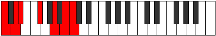

# Scale Thoptimic

## Links

- [Documentation](README.md)
- [Scales Index](Scales.md)
- [Modes Index](Modes.md)
- [Chords Index](Chords.md)

## Cardinality

6 Notes

## Perfection

- 2 Perfect Pitch
- 4 Imperfect Pitch
Perfection Profile - false, false, false, true, false, true

## Modes

| Number | Mode | Luminosity | Notes | Illustration | Audio |
|--------|------|------------|-------|--------------|-------|
| [621](https://ianring.com/musictheory/scales/621) | [Kyrimic](ModeKyrimic.md) | -1 | **C**, D, **Eb**, F, **Gb**, **A**, **C** |  | [midi](https://github.com/edipermadi/music/blob/main/docs/ModeCNaturalKyrimic.mid?raw=true) | 
| [873](https://ianring.com/musictheory/scales/873) | [Bagimic](ModeBagimic.md) | -1 | **C**, **D#**, E#, **F#**, G#, **A**, **C** |  | [midi](https://github.com/edipermadi/music/blob/main/docs/ModeCNaturalBagimic.mid?raw=true) | 
| [1179](https://ianring.com/musictheory/scales/1179) | [Sonimic](ModeSonimic.md) | -1 | C, **Db**, Eb, **Fb**, **G**, **A#**, C |  | [midi](https://github.com/edipermadi/music/blob/main/docs/ModeCNaturalSonimic.mid?raw=true) | 
| [1683](https://ianring.com/musictheory/scales/1683) | [Rygimic](ModeRygimic.md) | -1 | C, **Db**, **E**, **F##**, G##, **A#**, C |  | [midi](https://github.com/edipermadi/music/blob/main/docs/ModeCNaturalRygimic.mid?raw=true) | 
| [2637](https://ianring.com/musictheory/scales/2637) | [Aeolonimic](ModeAeolonimic.md) | -1 | **C**, D, **Eb**, **F#**, **G##**, A##, **C** |  | [midi](https://github.com/edipermadi/music/blob/main/docs/ModeCNaturalAeolonimic.mid?raw=true) | 
| [2889](https://ianring.com/musictheory/scales/2889) | [Thoptimic](ModeThoptimic.md) | -1 | **C**, **D#**, **E##**, F###, **G##**, A##, **C** |  | [midi](https://github.com/edipermadi/music/blob/main/docs/ModeCNaturalThoptimic.mid?raw=true) | 
