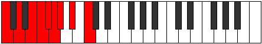
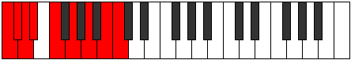
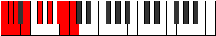
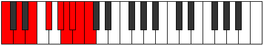

# Scale Thyryllic

## Links

- [Documentation](README.md)
- [Scales Index](Scales.md)
- [Modes Index](Modes.md)
- [Chords Index](Chords.md)

## Cardinality

8 Notes

## Perfection

- 4 Perfect Pitch
- 4 Imperfect Pitch
- [false true true false false true false true] Perfection Profile

## Modes

| Number | Mode | Notes | Illustration | Audio |
|--------|------|-------|--------------|-------|
| [1375](https://ianring.com/musictheory/scales/1375) | [Bothyllic](ModeBothyllic.md) | **C**, C#, **D**, D#, **E**, F#, G#, **A#**, **C** |  | [midi](https://github.com/edipermadi/music/blob/main/docs/ModeCNaturalBothyllic.mid?raw=true) | 
| [1405](https://ianring.com/musictheory/scales/1405) | [Goryllic](ModeGoryllic.md) | **C**, **D**, D#, **E**, F, **F#**, G#, A#, **C** |  | [midi](https://github.com/edipermadi/music/blob/main/docs/ModeCNaturalGoryllic.mid?raw=true) | 
| [1525](https://ianring.com/musictheory/scales/1525) | [Sodyllic](ModeSodyllic.md) | C, **D**, **E**, F, **F#**, G, **G#**, A#, C |  | [midi](https://github.com/edipermadi/music/blob/main/docs/ModeCNaturalSodyllic.mid?raw=true) | 
| [2005](https://ianring.com/musictheory/scales/2005) | [Gygyllic](ModeGygyllic.md) | C, D, **E**, **F#**, G, **G#**, A, **A#**, C |  | [midi](https://github.com/edipermadi/music/blob/main/docs/ModeCNaturalGygyllic.mid?raw=true) | 
| [2735](https://ianring.com/musictheory/scales/2735) | [Gynyllic](ModeGynyllic.md) | C, **C#**, D, **D#**, F, G, **A**, **B**, C |  | [midi](https://github.com/edipermadi/music/blob/main/docs/ModeCNaturalGynyllic.mid?raw=true) | 
| [3415](https://ianring.com/musictheory/scales/3415) | [Ionaptyllic](ModeIonaptyllic.md) | **C**, C#, **D**, E, F#, **G#**, **A#**, B, **C** |  | [midi](https://github.com/edipermadi/music/blob/main/docs/ModeCNaturalIonaptyllic.mid?raw=true) | 
| [3755](https://ianring.com/musictheory/scales/3755) | [Phryryllic](ModePhryryllic.md) | C, **C#**, D#, F, **G**, **A**, A#, **B**, C |  | [midi](https://github.com/edipermadi/music/blob/main/docs/ModeCNaturalPhryryllic.mid?raw=true) | 
| [3925](https://ianring.com/musictheory/scales/3925) | [Thyryllic](ModeThyryllic.md) | **C**, D, E, **F#**, **G#**, A, **A#**, B, **C** |  | [midi](https://github.com/edipermadi/music/blob/main/docs/ModeCNaturalThyryllic.mid?raw=true) | 
