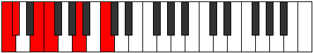
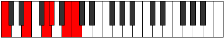

# Scale Zacritonic

## Links

- [Documentation](index.md)
- [Scales Index](Scales.md)
- [Modes Index](Modes.md)
- [Chords Index](Chords.md)

## Cardinality

5 Notes

## Perfection

- 2 Perfect Pitch
- 3 Imperfect Pitch
- [true true false false false] Perfection Profile

## Modes

| Number | Mode | Notes | Illustration | Audio |
|--------|------|-------|--------------|-------|
| [409](https://ianring.com/musictheory/scales/409) | [Laritonic](ModeLaritonic.md) | C, **D#**, **E**, **G**, G#, C |  | [midi](ModeCNaturalLaritonic.mid) [ogg](ModeCNaturalLaritonic.ogg) | 
| [563](https://ianring.com/musictheory/scales/563) | [Thacritonic](ModeThacritonic.md) | **C**, **C#**, **E**, F, A, **C** |  | [midi](ModeCNaturalThacritonic.mid) [ogg](ModeCNaturalThacritonic.ogg) | 
| [803](https://ianring.com/musictheory/scales/803) | [Loritonic](ModeLoritonic.md) | **C**, C#, F, **G#**, **A**, **C** |  | [midi](ModeCNaturalLoritonic.mid) [ogg](ModeCNaturalLoritonic.ogg) | 
| [2329](https://ianring.com/musictheory/scales/2329) | [Styditonic](ModeStyditonic.md) | **C**, **D#**, E, G#, **B**, **C** |  | [midi](ModeCNaturalStyditonic.mid) [ogg](ModeCNaturalStyditonic.ogg) | 
| [2449](https://ianring.com/musictheory/scales/2449) | [Zacritonic](ModeZacritonic.md) | C, E, **G**, **G#**, **B**, C |  | [midi](ModeCNaturalZacritonic.mid) [ogg](ModeCNaturalZacritonic.ogg) | 
