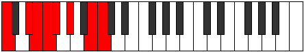

# Scale Zarian

## Links

- [Documentation](index.md)
- [Scales Index](Scales.md)
- [Modes Index](Modes.md)
- [Chords Index](Chords.md)

## Cardinality

7 Notes

## Perfection

- 4 Perfect Pitch
- 3 Imperfect Pitch
- [true true false false true true false] Perfection Profile

## Modes

| Number | Mode | Notes | Illustration | Audio |
|--------|------|-------|--------------|-------|
| [755](https://ianring.com/musictheory/scales/755) | [Phrythian](ModePhrythian.md) | C, **Db**, **E**, F, Gb, **Abb**, Bbb, C |  | [midi](ModeCNaturalPhrythian.mid) [ogg](ModeCNaturalPhrythian.ogg) | 
| [815](https://ianring.com/musictheory/scales/815) | [Bolian](ModeBolian.md) | **C**, Db, Ebb, **Fbb**, Gbb, Ab, **Bbb**, **C** |  | [midi](ModeCNaturalBolian.mid) [ogg](ModeCNaturalBolian.ogg) | 
| [1945](https://ianring.com/musictheory/scales/1945) | [Zarian](ModeZarian.md) | C, D#, **E**, **F##**, G#, A, **Bb**, C |  | [midi](ModeCNaturalZarian.mid) [ogg](ModeCNaturalZarian.ogg) | 
| [2425](https://ianring.com/musictheory/scales/2425) | [Rorian](ModeRorian.md) | **C**, **D#**, E, F, **Gb**, Ab, B, **C** |  | [midi](ModeCNaturalRorian.mid) [ogg](ModeCNaturalRorian.ogg) | 
| [2455](https://ianring.com/musictheory/scales/2455) | [Bothian](ModeBothian.md) | C, Db, **Ebb**, Fb, G, **Ab**, **B**, C |  | [midi](ModeCNaturalBothian.mid) [ogg](ModeCNaturalBothian.ogg) | 
| [3275](https://ianring.com/musictheory/scales/3275) | [Katadian](ModeKatadian.md) | C, **Db**, Eb, F#, **G**, **A#**, B, C |  | [midi](ModeCNaturalKatadian.mid) [ogg](ModeCNaturalKatadian.ogg) | 
| [3685](https://ianring.com/musictheory/scales/3685) | [Kodian](ModeKodian.md) | **C**, D, E#, **F#**, **G##**, A#, B, **C** |  | [midi](ModeCNaturalKodian.mid) [ogg](ModeCNaturalKodian.ogg) | 
