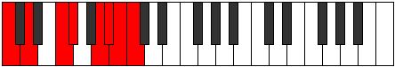

# Scale Zarian

## Links

- [Documentation](README.md)
- [Scales Index](Scales.md)
- [Modes Index](Modes.md)
- [Chords Index](Chords.md)

## Cardinality

7 Notes

## Perfection

- 4 Perfect Pitch
- 3 Imperfect Pitch
Perfection Profile - true, true, false, false, true, true, false

## Modes

| Number | Mode | Luminosity | Notes | Illustration | Audio |
|--------|------|------------|-------|--------------|-------|
| [755](https://ianring.com/musictheory/scales/755) | [Phrythian](ModePhrythian.md) | 6 | C, **Db**, **E**, F, Gb, **Abb**, Bbb, C |  | [midi](https://github.com/edipermadi/music/blob/main/docs/ModeCNaturalPhrythian.mid?raw=true) | 
| [815](https://ianring.com/musictheory/scales/815) | [Bolian](ModeBolian.md) | 6 | **C**, Db, Ebb, **Fbb**, Gbb, Ab, **Bbb**, **C** |  | [midi](https://github.com/edipermadi/music/blob/main/docs/ModeCNaturalBolian.mid?raw=true) | 
| [1945](https://ianring.com/musictheory/scales/1945) | [Zarian](ModeZarian.md) | -1 | C, D#, **E**, **F##**, G#, A, **Bb**, C |  | [midi](https://github.com/edipermadi/music/blob/main/docs/ModeCNaturalZarian.mid?raw=true) | 
| [2425](https://ianring.com/musictheory/scales/2425) | [Rorian](ModeRorian.md) | 6 | **C**, **D#**, E, F, **Gb**, Ab, B, **C** |  | [midi](https://github.com/edipermadi/music/blob/main/docs/ModeCNaturalRorian.mid?raw=true) | 
| [2455](https://ianring.com/musictheory/scales/2455) | [Bothian](ModeBothian.md) | -1 | C, Db, **Ebb**, Fb, G, **Ab**, **B**, C |  | [midi](https://github.com/edipermadi/music/blob/main/docs/ModeCNaturalBothian.mid?raw=true) | 
| [3275](https://ianring.com/musictheory/scales/3275) | [Katadian](ModeKatadian.md) | -1 | C, **Db**, Eb, F#, **G**, **A#**, B, C |  | [midi](https://github.com/edipermadi/music/blob/main/docs/ModeCNaturalKatadian.mid?raw=true) | 
| [3685](https://ianring.com/musictheory/scales/3685) | [Kodian](ModeKodian.md) | -1 | **C**, D, E#, **F#**, **G##**, A#, B, **C** |  | [midi](https://github.com/edipermadi/music/blob/main/docs/ModeCNaturalKodian.mid?raw=true) | 
