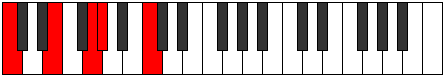

# Scale Zyphic

## Links

- [Documentation](README.md)
- [Scales Index](Scales.md)
- [Modes Index](Modes.md)
- [Chords Index](Chords.md)

## Cardinality

4 Notes

## Perfection

- 1 Perfect Pitch
- 3 Imperfect Pitch
Perfection Profile - false, true, false, false

## Modes

| Number | Mode | Luminosity | Notes | Illustration | Audio |
|--------|------|------------|-------|--------------|-------|
| [281](https://ianring.com/musictheory/scales/281) | [Lanic](ModeLanic.md) | -1 | **C**, **D#**, **E**, G#, **C** |  | [midi](https://github.com/edipermadi/music/blob/main/docs/ModeCNaturalLanic.mid?raw=true) | 
| [401](https://ianring.com/musictheory/scales/401) | [Epogic](ModeEpogic.md) | 4 | C, **E**, **G**, **G#**, C |  | [midi](https://github.com/edipermadi/music/blob/main/docs/ModeCNaturalEpogic.mid?raw=true) | 
| [547](https://ianring.com/musictheory/scales/547) | [Pyrric](ModePyrric.md) | 3 | **C**, **C#**, F, **A**, **C** |  | [midi](https://github.com/edipermadi/music/blob/main/docs/ModeCNaturalPyrric.mid?raw=true) | 
| [2321](https://ianring.com/musictheory/scales/2321) | [Zyphic](ModeZyphic.md) | -1 | **C**, E, **G#**, **B**, **C** |  | [midi](https://github.com/edipermadi/music/blob/main/docs/ModeCNaturalZyphic.mid?raw=true) | 
