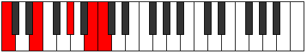

# Scale Zyphic

## Links

- [Documentation](index.md)
- [Scales Index](Scales.md)
- [Modes Index](Modes.md)
- [Chords Index](Chords.md)

## Cardinality

4 Notes

## Perfection

- 1 Perfect Pitch
- 3 Imperfect Pitch
- [false true false false] Perfection Profile

## Modes

| Number | Mode | Notes | Illustration | Audio |
|--------|------|-------|--------------|-------|
| [281](https://ianring.com/musictheory/scales/281) | [Lanic](ModeLanic.md) | **C**, **D#**, **E**, G#, **C** |  | [midi](ModeCNaturalLanic.mid) [ogg](ModeCNaturalLanic.ogg) | 
| [401](https://ianring.com/musictheory/scales/401) | [Epogic](ModeEpogic.md) | C, **E**, **G**, **G#**, C |  | [midi](ModeCNaturalEpogic.mid) [ogg](ModeCNaturalEpogic.ogg) | 
| [547](https://ianring.com/musictheory/scales/547) | [Pyrric](ModePyrric.md) | **C**, **C#**, F, **A**, **C** |  | [midi](ModeCNaturalPyrric.mid) [ogg](ModeCNaturalPyrric.ogg) | 
| [2321](https://ianring.com/musictheory/scales/2321) | [Zyphic](ModeZyphic.md) | **C**, E, **G#**, **B**, **C** |  | [midi](ModeCNaturalZyphic.mid) [ogg](ModeCNaturalZyphic.ogg) | 
