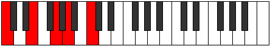
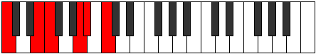
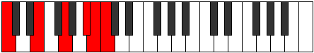
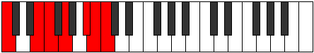
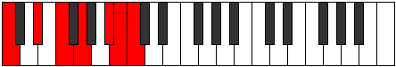
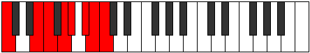
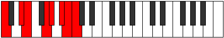
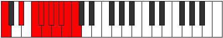

# Scales

## Links

- [Documentation](README.md)
- [Scales Index](Scales.md)
- [Modes Index](Modes.md)
- [Chords Index](Chords.md)

## Index

| Scale | Cardinality | Transposition | Perfection | Imperfection | Illustration |
|-------|-------------|---------------|------------|--------------|--------------|
| [Minoric](ScaleMinoric.md) | 3 | 4, 4, 4 | 0 | 3 |  | 
| [Thaptic](ScaleThaptic.md) | 4 | 4, 3, 4, 1 | 2 | 2 |  | 
| [Epathic](ScaleEpathic.md) | 4 | 4, 3, 2, 3 | 2 | 2 |  | 
| [Zyphic](ScaleZyphic.md) | 4 | 4, 4, 3, 1 | 1 | 3 |  | 
| [Aeoloric](ScaleAeoloric.md) | 4 | 4, 4, 1, 3 | 1 | 3 |  | 
| [Daric](ScaleDaric.md) | 4 | 4, 3, 3, 2 | 1 | 3 |  | 
| [Saric](ScaleSaric.md) | 4 | 4, 2, 3, 3 | 1 | 3 |  | 
| [Aeolic](ScaleAeolic.md) | 4 | 4, 4, 2, 2 | 0 | 4 |  | 
| [Stathic](ScaleStathic.md) | 4 | 4, 2, 4, 2 | 0 | 4 |  | 
| [Phrynic](ScalePhrynic.md) | 4 | 3, 3, 3, 3 | 0 | 4 |  | 
| [Epathitonic](ScaleEpathitonic.md) | 5 | 3, 2, 3, 2, 2 | 4 | 1 |  | 
| [Magitonic](ScaleMagitonic.md) | 5 | 4, 3, 2, 2, 1 | 3 | 2 |  | 
| [Gathitonic](ScaleGathitonic.md) | 5 | 4, 2, 3, 2, 1 | 3 | 2 |  | 
| [Zolitonic](ScaleZolitonic.md) | 5 | 4, 2, 1, 4, 1 | 3 | 2 |  | 
| [Phraditonic](ScalePhraditonic.md) | 5 | 4, 1, 4, 1, 2 | 3 | 2 |  | 
| [Aeracritonic](ScaleAeracritonic.md) | 5 | 4, 1, 2, 3, 2 | 3 | 2 |  | 
| [Lothitonic](ScaleLothitonic.md) | 5 | 4, 1, 2, 2, 3 | 3 | 2 |  | 
| [Dolitonic](ScaleDolitonic.md) | 5 | 4, 4, 1, 2, 1 | 2 | 3 |  | 
| [Molitonic](ScaleMolitonic.md) | 5 | 4, 3, 3, 1, 1 | 2 | 3 |  | 
| [Ionaditonic](ScaleIonaditonic.md) | 5 | 4, 3, 2, 1, 2 | 2 | 3 |  | 
| [Zacritonic](ScaleZacritonic.md) | 5 | 4, 3, 1, 3, 1 | 2 | 3 |  | 
| [Aeolyritonic](ScaleAeolyritonic.md) | 5 | 4, 3, 1, 1, 3 | 2 | 3 |  | 
| [Zathitonic](ScaleZathitonic.md) | 5 | 4, 2, 4, 1, 1 | 2 | 3 |  | 
| [Aeolanitonic](ScaleAeolanitonic.md) | 5 | 4, 2, 2, 3, 1 | 2 | 3 |  | 
| [Aeolacritonic](ScaleAeolacritonic.md) | 5 | 4, 2, 1, 2, 3 | 2 | 3 |  | 
| [Lycritonic](ScaleLycritonic.md) | 5 | 4, 1, 3, 3, 1 | 2 | 3 |  | 
| [Epygitonic](ScaleEpygitonic.md) | 5 | 4, 1, 3, 2, 2 | 2 | 3 |  | 
| [Zothitonic](ScaleZothitonic.md) | 5 | 4, 1, 3, 1, 3 | 2 | 3 |  | 
| [Ionyptitonic](ScaleIonyptitonic.md) | 5 | 4, 1, 1, 3, 3 | 2 | 3 |  | 
| [Thoditonic](ScaleThoditonic.md) | 5 | 3, 3, 2, 3, 1 | 2 | 3 |  | 
| [Kataritonic](ScaleKataritonic.md) | 5 | 3, 3, 2, 2, 2 | 2 | 3 |  | 
| [Lyditonic](ScaleLyditonic.md) | 5 | 3, 3, 1, 3, 2 | 2 | 3 |  | 
| [Zylitonic](ScaleZylitonic.md) | 5 | 4, 4, 2, 1, 1 | 1 | 4 |  | 
| [Ranitonic](ScaleRanitonic.md) | 5 | 4, 4, 1, 1, 2 | 1 | 4 |  | 
| [Ryphitonic](ScaleRyphitonic.md) | 5 | 4, 3, 1, 2, 2 | 1 | 4 |  | 
| [Phronitonic](ScalePhronitonic.md) | 5 | 4, 2, 3, 1, 2 | 1 | 4 |  | 
| [Aerynitonic](ScaleAerynitonic.md) | 5 | 4, 2, 2, 1, 3 | 1 | 4 |  | 
| [Ionoditonic](ScaleIonoditonic.md) | 5 | 4, 2, 1, 3, 2 | 1 | 4 |  | 
| [Mixitonic](ScaleMixitonic.md) | 5 | 3, 3, 3, 2, 1 | 1 | 4 |  | 
| [Thyritonic](ScaleThyritonic.md) | 5 | 3, 3, 3, 1, 2 | 1 | 4 |  | 
| [Bolitonic](ScaleBolitonic.md) | 5 | 4, 2, 2, 2, 2 | 0 | 5 |  | 
| [Epathimic](ScaleEpathimic.md) | 6 | 3, 2, 2, 1, 2, 2 | 5 | 1 |  | 
| [Dyrimic](ScaleDyrimic.md) | 6 | 4, 2, 1, 2, 2, 1 | 4 | 2 |  | 
| [Daptimic](ScaleDaptimic.md) | 6 | 4, 1, 4, 1, 1, 1 | 4 | 2 |  | 
| [Epygimic](ScaleEpygimic.md) | 6 | 4, 1, 2, 3, 1, 1 | 4 | 2 |  | 
| [Bylimic](ScaleBylimic.md) | 6 | 4, 1, 2, 2, 2, 1 | 4 | 2 |  | 
| [Garimic](ScaleGarimic.md) | 6 | 4, 1, 2, 2, 1, 2 | 4 | 2 |  | 
| [Thonimic](ScaleThonimic.md) | 6 | 4, 1, 1, 4, 1, 1 | 4 | 2 |  | 
| [Mythimic](ScaleMythimic.md) | 6 | 4, 1, 1, 3, 2, 1 | 4 | 2 |  | 
| [Mixolimic](ScaleMixolimic.md) | 6 | 3, 2, 3, 2, 1, 1 | 4 | 2 |  | 
| [Ionacrimic](ScaleIonacrimic.md) | 6 | 3, 2, 3, 1, 1, 2 | 4 | 2 |  | 
| [Dalimic](ScaleDalimic.md) | 6 | 3, 2, 2, 3, 1, 1 | 4 | 2 |  | 
| [Darmic](ScaleDarmic.md) | 6 | 3, 2, 2, 2, 1, 2 | 4 | 2 |  | 
| [Phracrimic](ScalePhracrimic.md) | 6 | 3, 2, 1, 2, 2, 2 | 4 | 2 |  | 
| [Starimic](ScaleStarimic.md) | 6 | 4, 3, 2, 1, 1, 1 | 3 | 3 |  | 
| [Bygimic](ScaleBygimic.md) | 6 | 4, 3, 1, 1, 2, 1 | 3 | 3 |  | 
| [Stalimic](ScaleStalimic.md) | 6 | 4, 2, 3, 1, 1, 1 | 3 | 3 |  | 
| [Rycrimic](ScaleRycrimic.md) | 6 | 4, 2, 2, 1, 2, 1 | 3 | 3 |  | 
| [Katythimic](ScaleKatythimic.md) | 6 | 4, 2, 1, 3, 1, 1 | 3 | 3 |  | 
| [Aerycrimic](ScaleAerycrimic.md) | 6 | 4, 2, 1, 1, 3, 1 | 3 | 3 |  | 
| [Phralimic](ScalePhralimic.md) | 6 | 4, 1, 3, 2, 1, 1 | 3 | 3 |  | 
| [Solimic](ScaleSolimic.md) | 6 | 4, 1, 3, 1, 2, 1 | 3 | 3 |  | 
| [Thogimic](ScaleThogimic.md) | 6 | 4, 1, 3, 1, 1, 2 | 3 | 3 |  | 
| [Laptimic](ScaleLaptimic.md) | 6 | 4, 1, 2, 1, 3, 1 | 3 | 3 |  | 
| [Modimic](ScaleModimic.md) | 6 | 4, 1, 2, 1, 2, 2 | 3 | 3 |  | 
| [Syrimic](ScaleSyrimic.md) | 6 | 4, 1, 2, 1, 1, 3 | 3 | 3 |  | 
| [Bolimic](ScaleBolimic.md) | 6 | 4, 1, 1, 3, 1, 2 | 3 | 3 |  | 
| [Kanimic](ScaleKanimic.md) | 6 | 4, 1, 1, 2, 3, 1 | 3 | 3 |  | 
| [Pynimic](ScalePynimic.md) | 6 | 4, 1, 1, 1, 3, 2 | 3 | 3 |  | 
| [Kytrimic](ScaleKytrimic.md) | 6 | 4, 1, 1, 1, 2, 3 | 3 | 3 |  | 
| [Palimic](ScalePalimic.md) | 6 | 3, 3, 2, 2, 1, 1 | 3 | 3 |  | 
| [Ionodimic](ScaleIonodimic.md) | 6 | 3, 3, 1, 3, 1, 1 | 3 | 3 |  | 
| [Mydimic](ScaleMydimic.md) | 6 | 3, 3, 1, 1, 3, 1 | 3 | 3 |  | 
| [Zagimic](ScaleZagimic.md) | 6 | 3, 3, 1, 1, 2, 2 | 3 | 3 |  | 
| [Mothimic](ScaleMothimic.md) | 6 | 3, 2, 2, 1, 3, 1 | 3 | 3 |  | 
| [Bocrimic](ScaleBocrimic.md) | 6 | 3, 2, 1, 3, 1, 2 | 3 | 3 |  | 
| [Zacrimic](ScaleZacrimic.md) | 6 | 3, 2, 1, 2, 3, 1 | 3 | 3 |  | 
| [Ionythimic](ScaleIonythimic.md) | 6 | 3, 1, 3, 1, 3, 1 | 3 | 3 |  | 
| [Dynimic](ScaleDynimic.md) | 6 | 3, 1, 3, 1, 2, 2 | 3 | 3 |  | 
| [Ponimic](ScalePonimic.md) | 6 | 4, 4, 1, 1, 1, 1 | 2 | 4 |  | 
| [Lathimic](ScaleLathimic.md) | 6 | 4, 3, 1, 2, 1, 1 | 2 | 4 |  | 
| [Galimic](ScaleGalimic.md) | 6 | 4, 3, 1, 1, 1, 2 | 2 | 4 |  | 
| [Katanimic](ScaleKatanimic.md) | 6 | 4, 2, 2, 2, 1, 1 | 2 | 4 |  | 
| [Manimic](ScaleManimic.md) | 6 | 4, 2, 1, 2, 1, 2 | 2 | 4 |  | 
| [Kocrimic](ScaleKocrimic.md) | 6 | 4, 2, 1, 1, 1, 3 | 2 | 4 |  | 
| [Mycrimic](ScaleMycrimic.md) | 6 | 4, 1, 1, 2, 2, 2 | 2 | 4 |  | 
| [Aerothimic](ScaleAerothimic.md) | 6 | 4, 1, 1, 2, 1, 3 | 2 | 4 |  | 
| [Epynimic](ScaleEpynimic.md) | 6 | 3, 3, 3, 1, 1, 1 | 2 | 4 |  | 
| [Thoptimic](ScaleThoptimic.md) | 6 | 3, 3, 2, 1, 2, 1 | 2 | 4 |  | 
| [Thagimic](ScaleThagimic.md) | 6 | 3, 3, 2, 1, 1, 2 | 2 | 4 |  | 
| [Dagimic](ScaleDagimic.md) | 6 | 3, 3, 1, 2, 2, 1 | 2 | 4 |  | 
| [Thalimic](ScaleThalimic.md) | 6 | 3, 3, 1, 2, 1, 2 | 2 | 4 |  | 
| [Stythimic](ScaleStythimic.md) | 6 | 3, 2, 3, 1, 2, 1 | 2 | 4 |  | 
| [Aeragimic](ScaleAeragimic.md) | 6 | 3, 2, 2, 2, 2, 1 | 2 | 4 |  | 
| [Aeradimic](ScaleAeradimic.md) | 6 | 3, 2, 1, 3, 2, 1 | 2 | 4 |  | 
| [Lythimic](ScaleLythimic.md) | 6 | 3, 1, 2, 3, 1, 2 | 2 | 4 |  | 
| [Boptimic](ScaleBoptimic.md) | 6 | 3, 1, 2, 2, 2, 2 | 2 | 4 |  | 
| [Dathimic](ScaleDathimic.md) | 6 | 4, 2, 2, 1, 1, 2 | 1 | 5 |  | 
| [Gacrimic](ScaleGacrimic.md) | 6 | 4, 2, 1, 1, 2, 2 | 1 | 5 |  | 
| [WholeTone](ScaleWholeTone.md) | 6 | 2, 2, 2, 2, 2, 2 | 0 | 6 |  | 
| [Lydian](ScaleLydian.md) | 7 | 2, 2, 2, 1, 2, 2, 1 | 6 | 1 |  | 
| [Ionythian](ScaleIonythian.md) | 7 | 4, 1, 2, 2, 1, 1, 1 | 5 | 2 |  | 
| [Ionarian](ScaleIonarian.md) | 7 | 4, 1, 1, 3, 1, 1, 1 | 5 | 2 |  | 
| [Aeolacrian](ScaleAeolacrian.md) | 7 | 4, 1, 1, 1, 3, 1, 1 | 5 | 2 |  | 
| [Zogian](ScaleZogian.md) | 7 | 4, 1, 1, 1, 2, 2, 1 | 5 | 2 |  | 
| [Phrolian](ScalePhrolian.md) | 7 | 3, 2, 2, 1, 2, 1, 1 | 5 | 2 |  | 
| [Soptian](ScaleSoptian.md) | 7 | 3, 2, 2, 1, 1, 1, 2 | 5 | 2 |  | 
| [Thonian](ScaleThonian.md) | 7 | 3, 2, 1, 2, 2, 1, 1 | 5 | 2 |  | 
| [Epathian](ScaleEpathian.md) | 7 | 3, 2, 1, 1, 3, 1, 1 | 5 | 2 |  | 
| [Stathian](ScaleStathian.md) | 7 | 3, 2, 1, 1, 1, 2, 2 | 5 | 2 |  | 
| [Epogian](ScaleEpogian.md) | 7 | 3, 1, 1, 3, 1, 1, 2 | 5 | 2 |  | 
| [Ionycrian](ScaleIonycrian.md) | 7 | 3, 1, 1, 2, 2, 1, 2 | 5 | 2 |  | 
| [Aerathian](ScaleAerathian.md) | 7 | 3, 1, 1, 2, 1, 2, 2 | 5 | 2 |  | 
| [Aeopian](ScaleAeopian.md) | 7 | 4, 2, 1, 2, 1, 1, 1 | 4 | 3 |  | 
| [Epycrian](ScaleEpycrian.md) | 7 | 4, 2, 1, 1, 1, 2, 1 | 4 | 3 |  | 
| [Parian](ScaleParian.md) | 7 | 4, 1, 3, 1, 1, 1, 1 | 4 | 3 |  | 
| [Stygian](ScaleStygian.md) | 7 | 4, 1, 2, 1, 2, 1, 1 | 4 | 3 |  | 
| [Stythian](ScaleStythian.md) | 7 | 4, 1, 2, 1, 1, 2, 1 | 4 | 3 |  | 
| [Zorian](ScaleZorian.md) | 7 | 4, 1, 2, 1, 1, 1, 2 | 4 | 3 |  | 
| [Thacrian](ScaleThacrian.md) | 7 | 4, 1, 1, 2, 2, 1, 1 | 4 | 3 |  | 
| [Aeolathian](ScaleAeolathian.md) | 7 | 4, 1, 1, 2, 1, 2, 1 | 4 | 3 |  | 
| [Saptian](ScaleSaptian.md) | 7 | 4, 1, 1, 1, 2, 1, 2 | 4 | 3 |  | 
| [Thycrian](ScaleThycrian.md) | 7 | 4, 1, 1, 1, 1, 3, 1 | 4 | 3 |  | 
| [Stalian](ScaleStalian.md) | 7 | 3, 3, 1, 1, 2, 1, 1 | 4 | 3 |  | 
| [Morian](ScaleMorian.md) | 7 | 3, 2, 3, 1, 1, 1, 1 | 4 | 3 |  | 
| [Phraptian](ScalePhraptian.md) | 7 | 3, 2, 2, 2, 1, 1, 1 | 4 | 3 |  | 
| [Katocrian](ScaleKatocrian.md) | 7 | 3, 2, 1, 3, 1, 1, 1 | 4 | 3 |  | 
| [Ionopian](ScaleIonopian.md) | 7 | 3, 2, 1, 2, 1, 1, 2 | 4 | 3 |  | 
| [Rythian](ScaleRythian.md) | 7 | 3, 2, 1, 1, 2, 1, 2 | 4 | 3 |  | 
| [Laptian](ScaleLaptian.md) | 7 | 3, 2, 1, 1, 1, 3, 1 | 4 | 3 |  | 
| [Katathian](ScaleKatathian.md) | 7 | 3, 1, 3, 1, 2, 1, 1 | 4 | 3 |  | 
| [Tholian](ScaleTholian.md) | 7 | 3, 1, 3, 1, 1, 2, 1 | 4 | 3 |  | 
| [Zarian](ScaleZarian.md) | 7 | 3, 1, 3, 1, 1, 1, 2 | 4 | 3 |  | 
| [Ranian](ScaleRanian.md) | 7 | 3, 1, 2, 3, 1, 1, 1 | 4 | 3 |  | 
| [Golian](ScaleGolian.md) | 7 | 3, 1, 2, 2, 2, 1, 1 | 4 | 3 |  | 
| [Palian](ScalePalian.md) | 7 | 3, 1, 2, 2, 1, 2, 1 | 4 | 3 |  | 
| [Loptian](ScaleLoptian.md) | 7 | 3, 1, 2, 1, 3, 1, 1 | 4 | 3 |  | 
| [Bycrian](ScaleBycrian.md) | 7 | 3, 1, 2, 1, 2, 2, 1 | 4 | 3 |  | 
| [Dolian](ScaleDolian.md) | 7 | 3, 1, 1, 2, 2, 2, 1 | 4 | 3 |  | 
| [Pagian](ScalePagian.md) | 7 | 3, 1, 1, 1, 2, 2, 2 | 4 | 3 |  | 
| [Larian](ScaleLarian.md) | 7 | 2, 2, 2, 2, 1, 2, 1 | 4 | 3 |  | 
| [Thadian](ScaleThadian.md) | 7 | 4, 3, 1, 1, 1, 1, 1 | 3 | 4 |  | 
| [Pythian](ScalePythian.md) | 7 | 4, 2, 2, 1, 1, 1, 1 | 3 | 4 |  | 
| [Katogian](ScaleKatogian.md) | 7 | 4, 2, 1, 1, 2, 1, 1 | 3 | 4 |  | 
| [Katacrian](ScaleKatacrian.md) | 7 | 4, 1, 1, 2, 1, 1, 2 | 3 | 4 |  | 
| [Stanian](ScaleStanian.md) | 7 | 4, 1, 1, 1, 1, 2, 2 | 3 | 4 |  | 
| [Katyptian](ScaleKatyptian.md) | 7 | 4, 1, 1, 1, 1, 1, 3 | 3 | 4 |  | 
| [Bonian](ScaleBonian.md) | 7 | 3, 3, 2, 1, 1, 1, 1 | 3 | 4 |  | 
| [Epagian](ScaleEpagian.md) | 7 | 3, 3, 1, 2, 1, 1, 1 | 3 | 4 |  | 
| [Gacrian](ScaleGacrian.md) | 7 | 3, 3, 1, 1, 1, 2, 1 | 3 | 4 |  | 
| [Katoptian](ScaleKatoptian.md) | 7 | 3, 3, 1, 1, 1, 1, 2 | 3 | 4 |  | 
| [Epacrian](ScaleEpacrian.md) | 7 | 3, 2, 2, 1, 1, 2, 1 | 3 | 4 |  | 
| [Pogian](ScalePogian.md) | 7 | 3, 2, 1, 2, 1, 2, 1 | 3 | 4 |  | 
| [Eporian](ScaleEporian.md) | 7 | 3, 2, 1, 1, 2, 2, 1 | 3 | 4 |  | 
| [Korian](ScaleKorian.md) | 7 | 3, 1, 2, 2, 1, 1, 2 | 3 | 4 |  | 
| [Mycrian](ScaleMycrian.md) | 7 | 3, 1, 2, 1, 2, 1, 2 | 3 | 4 |  | 
| [Ionanian](ScaleIonanian.md) | 7 | 3, 1, 2, 1, 1, 2, 2 | 3 | 4 |  | 
| [Gydian](ScaleGydian.md) | 7 | 4, 2, 1, 1, 1, 1, 2 | 2 | 5 |  | 
| [Aeolynian](ScaleAeolynian.md) | 7 | 2, 2, 2, 2, 2, 1, 1 | 2 | 5 |  | 
| [Aerycryllic](ScaleAerycryllic.md) | 8 | 2, 2, 1, 2, 2, 1, 1, 1 | 7 | 1 |  | 
| [Pynyllic](ScalePynyllic.md) | 8 | 4, 1, 1, 1, 2, 1, 1, 1 | 6 | 2 |  | 
| [Pothyllic](ScalePothyllic.md) | 8 | 3, 2, 1, 1, 1, 2, 1, 1 | 6 | 2 |  | 
| [Locryllic](ScaleLocryllic.md) | 8 | 3, 1, 1, 3, 1, 1, 1, 1 | 6 | 2 |  | 
| [Aeracryllic](ScaleAeracryllic.md) | 8 | 3, 1, 1, 2, 2, 1, 1, 1 | 6 | 2 |  | 
| [Dydyllic](ScaleDydyllic.md) | 8 | 3, 1, 1, 2, 1, 2, 1, 1 | 6 | 2 |  | 
| [Dagyllic](ScaleDagyllic.md) | 8 | 3, 1, 1, 2, 1, 1, 1, 2 | 6 | 2 |  | 
| [Sydyllic](ScaleSydyllic.md) | 8 | 3, 1, 1, 1, 3, 1, 1, 1 | 6 | 2 |  | 
| [Bacryllic](ScaleBacryllic.md) | 8 | 3, 1, 1, 1, 2, 2, 1, 1 | 6 | 2 |  | 
| [Rocryllic](ScaleRocryllic.md) | 8 | 2, 2, 2, 1, 2, 1, 1, 1 | 6 | 2 |  | 
| [Ionocryllic](ScaleIonocryllic.md) | 8 | 2, 2, 2, 1, 1, 1, 2, 1 | 6 | 2 |  | 
| [Ionoptyllic](ScaleIonoptyllic.md) | 8 | 2, 2, 1, 2, 1, 1, 2, 1 | 6 | 2 |  | 
| [Dolyllic](ScaleDolyllic.md) | 8 | 4, 1, 2, 1, 1, 1, 1, 1 | 5 | 3 |  | 
| [Thagyllic](ScaleThagyllic.md) | 8 | 4, 1, 1, 2, 1, 1, 1, 1 | 5 | 3 |  | 
| [Aeoladyllic](ScaleAeoladyllic.md) | 8 | 4, 1, 1, 1, 1, 2, 1, 1 | 5 | 3 |  | 
| [Phroryllic](ScalePhroryllic.md) | 8 | 4, 1, 1, 1, 1, 1, 2, 1 | 5 | 3 |  | 
| [Phranyllic](ScalePhranyllic.md) | 8 | 3, 2, 2, 1, 1, 1, 1, 1 | 5 | 3 |  | 
| [Lydyllic](ScaleLydyllic.md) | 8 | 3, 2, 1, 2, 1, 1, 1, 1 | 5 | 3 |  | 
| [Zoryllic](ScaleZoryllic.md) | 8 | 3, 2, 1, 1, 2, 1, 1, 1 | 5 | 3 |  | 
| [Mixolydyllic](ScaleMixolydyllic.md) | 8 | 3, 2, 1, 1, 1, 1, 1, 2 | 5 | 3 |  | 
| [Ioniptyllic](ScaleIoniptyllic.md) | 8 | 3, 1, 3, 1, 1, 1, 1, 1 | 5 | 3 |  | 
| [Aeolothyllic](ScaleAeolothyllic.md) | 8 | 3, 1, 2, 2, 1, 1, 1, 1 | 5 | 3 |  | 
| [Maptyllic](ScaleMaptyllic.md) | 8 | 3, 1, 2, 1, 2, 1, 1, 1 | 5 | 3 |  | 
| [Thyptyllic](ScaleThyptyllic.md) | 8 | 3, 1, 2, 1, 1, 2, 1, 1 | 5 | 3 |  | 
| [Doptyllic](ScaleDoptyllic.md) | 8 | 3, 1, 2, 1, 1, 1, 2, 1 | 5 | 3 |  | 
| [Lonyllic](ScaleLonyllic.md) | 8 | 3, 1, 1, 2, 1, 1, 2, 1 | 5 | 3 |  | 
| [Aeolathyllic](ScaleAeolathyllic.md) | 8 | 3, 1, 1, 1, 2, 1, 2, 1 | 5 | 3 |  | 
| [Zagyllic](ScaleZagyllic.md) | 8 | 3, 1, 1, 1, 2, 1, 1, 2 | 5 | 3 |  | 
| [Gythyllic](ScaleGythyllic.md) | 8 | 3, 1, 1, 1, 1, 2, 2, 1 | 5 | 3 |  | 
| [Tharyllic](ScaleTharyllic.md) | 8 | 3, 1, 1, 1, 1, 2, 1, 2 | 5 | 3 |  | 
| [Kataryllic](ScaleKataryllic.md) | 8 | 3, 1, 1, 1, 1, 1, 2, 2 | 5 | 3 |  | 
| [Stogyllic](ScaleStogyllic.md) | 8 | 2, 2, 1, 2, 1, 2, 1, 1 | 5 | 3 |  | 
| [Dalyllic](ScaleDalyllic.md) | 8 | 2, 2, 1, 1, 2, 1, 2, 1 | 5 | 3 |  | 
| [Stycryllic](ScaleStycryllic.md) | 8 | 4, 2, 1, 1, 1, 1, 1, 1 | 4 | 4 |  | 
| [Stolyllic](ScaleStolyllic.md) | 8 | 4, 1, 1, 1, 1, 1, 1, 2 | 4 | 4 |  | 
| [Zaryllic](ScaleZaryllic.md) | 8 | 3, 3, 1, 1, 1, 1, 1, 1 | 4 | 4 |  | 
| [Aeronyllic](ScaleAeronyllic.md) | 8 | 3, 2, 1, 1, 1, 1, 2, 1 | 4 | 4 |  | 
| [Stacryllic](ScaleStacryllic.md) | 8 | 3, 1, 2, 1, 1, 1, 1, 2 | 4 | 4 |  | 
| [Thyryllic](ScaleThyryllic.md) | 8 | 2, 2, 2, 2, 1, 1, 1, 1 | 4 | 4 |  | 
| [Racryllic](ScaleRacryllic.md) | 8 | 2, 2, 2, 1, 1, 2, 1, 1 | 4 | 4 |  | 
| [Epotyllic](ScaleEpotyllic.md) | 8 | 2, 2, 1, 1, 2, 2, 1, 1 | 4 | 4 |  | 
| [MajorDiminished](ScaleMajorDiminished.md) | 8 | 2, 1, 2, 1, 2, 1, 2, 1 | 4 | 4 |  | 
| [Aerycrygic](ScaleAerycrygic.md) | 9 | 2, 2, 1, 1, 1, 2, 1, 1, 1 | 8 | 1 |  | 
| [Kalygic](ScaleKalygic.md) | 9 | 3, 1, 1, 2, 1, 1, 1, 1, 1 | 7 | 2 |  | 
| [Mixolydygic](ScaleMixolydygic.md) | 9 | 3, 1, 1, 1, 2, 1, 1, 1, 1 | 7 | 2 |  | 
| [Dycrygic](ScaleDycrygic.md) | 9 | 3, 1, 1, 1, 1, 2, 1, 1, 1 | 7 | 2 |  | 
| [Loptygic](ScaleLoptygic.md) | 9 | 3, 1, 1, 1, 1, 1, 2, 1, 1 | 7 | 2 |  | 
| [Bagygic](ScaleBagygic.md) | 9 | 2, 2, 1, 2, 1, 1, 1, 1, 1 | 7 | 2 |  | 
| [Apinygic](ScaleApinygic.md) | 9 | 2, 2, 1, 1, 1, 1, 1, 2, 1 | 7 | 2 |  | 
| [Epyrygic](ScaleEpyrygic.md) | 9 | 2, 1, 2, 1, 1, 2, 1, 1, 1 | 7 | 2 |  | 
| [Aeolorygic](ScaleAeolorygic.md) | 9 | 2, 1, 2, 1, 1, 1, 2, 1, 1 | 7 | 2 |  | 
| [Manygic](ScaleManygic.md) | 9 | 4, 1, 1, 1, 1, 1, 1, 1, 1 | 6 | 3 |  | 
| [Sathygic](ScaleSathygic.md) | 9 | 3, 2, 1, 1, 1, 1, 1, 1, 1 | 6 | 3 |  | 
| [Phrygic](ScalePhrygic.md) | 9 | 3, 1, 2, 1, 1, 1, 1, 1, 1 | 6 | 3 |  | 
| [Zothygic](ScaleZothygic.md) | 9 | 3, 1, 1, 1, 1, 1, 1, 2, 1 | 6 | 3 |  | 
| [Aeolacrygic](ScaleAeolacrygic.md) | 9 | 3, 1, 1, 1, 1, 1, 1, 1, 2 | 6 | 3 |  | 
| [Kyrygic](ScaleKyrygic.md) | 9 | 2, 2, 2, 1, 1, 1, 1, 1, 1 | 6 | 3 |  | 
| [Porygic](ScalePorygic.md) | 9 | 2, 2, 1, 1, 2, 1, 1, 1, 1 | 6 | 3 |  | 
| [Kaptygic](ScaleKaptygic.md) | 9 | 2, 2, 1, 1, 1, 1, 2, 1, 1 | 6 | 3 |  | 
| [Koptygic](ScaleKoptygic.md) | 9 | 2, 1, 2, 1, 2, 1, 1, 1, 1 | 6 | 3 |  | 
| [Phronygic](ScalePhronygic.md) | 9 | 2, 1, 1, 2, 1, 1, 2, 1, 1 | 6 | 3 |  | 
| [Aerycryllian](ScaleAerycryllian.md) | 10 | 2, 1, 1, 1, 2, 1, 1, 1, 1, 1 | 9 | 1 |  | 
| [Katoryllian](ScaleKatoryllian.md) | 10 | 3, 1, 1, 1, 1, 1, 1, 1, 1, 1 | 8 | 2 |  | 
| [Sydyllian](ScaleSydyllian.md) | 10 | 2, 2, 1, 1, 1, 1, 1, 1, 1, 1 | 8 | 2 |  | 
| [Gothyllian](ScaleGothyllian.md) | 10 | 2, 1, 2, 1, 1, 1, 1, 1, 1, 1 | 8 | 2 |  | 
| [Staptyllian](ScaleStaptyllian.md) | 10 | 2, 1, 1, 2, 1, 1, 1, 1, 1, 1 | 8 | 2 |  | 
| [Thydyllian](ScaleThydyllian.md) | 10 | 2, 1, 1, 1, 1, 2, 1, 1, 1, 1 | 8 | 2 |  | 
| [Aerycratic](ScaleAerycratic.md) | 11 | 2, 1, 1, 1, 1, 1, 1, 1, 1, 1, 1 | 10 | 1 |  | 
| [Chromatic](ScaleChromatic.md) | 12 | 1, 1, 1, 1, 1, 1, 1, 1, 1, 1, 1, 1 | 12 | 0 |  | 
